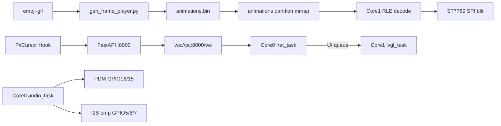

# ESP32-S3 Agent Display

[中文](README.md) | **English** · [开发环境搭建](docs/开发环境搭建.md) · [Dev Setup (EN)](docs/dev-setup.en.md)

ESP32-S3 N16R8 desktop status display: WebSocket status push, offline RGB565 RLE emoji, PDM always-on listening, PC backend ASR + LLM, timestamped web logs.

| Item | Spec |
|------|------|
| Firmware | ESP-IDF **5.4.2** + FreeRTOS + LVGL **9.2.2** |
| Transport | WebSocket (`espressif/esp_websocket_client`) |
| Backend | FastAPI + uvicorn, default `:8000` |

### Preview

| Hardware prototype | Web dashboard |
|:--:|:--:|
|  |  |
| ST7789 round display showing Cursor agent status | Backend dashboard: status push, voice, BLE/AP setup, LLM config |

### Design rules

1. **Audio on Core 0**, priority above LVGL; late I2S feeding causes crackling / mic stalls.
2. **Only `lvgl` task may call LVGL APIs**; all others post to a FreeRTOS queue.
3. **Emoji via offline RLE + Core 1 SPI blit**; do not enable `lv_gif` on device.
4. **PDM DATA on GPIO16**; never GPIO48 (on-board WS2812) or GPIO3 (strapping).
5. **LLM keys live in `backend/llm.json` (editable in Dashboard) or seed in `backend/.env`**; both are gitignored; never commit secrets.



---

## Table of contents

- [1. Hardware](#1-hardware)
- [2. Firmware architecture](#2-firmware-architecture)
- [3. FreeRTOS dual-core & tasks](#3-freertos-dual-core--tasks)
- [4. Core features](#4-core-features)
- [5. Backend service](#5-backend-service)
- [6. Build & deploy](#6-build--deploy)
- [Appendix](#appendix)

---

## 1. Hardware

### 1.1 Architecture

| Subsystem | Spec | Notes |
|-----------|------|-------|
| MCU | ESP32-S3 N16R8 | Dual Xtensa LX7, **240 MHz** |
| Flash | 16 MB QIO 80 MHz | Custom `partitions.csv` |
| PSRAM | 8 MB OPI 80 MHz | `SPIRAM_USE_MALLOC`; large buffers in PSRAM |
| Display | ST7789 240×240 | **SPI** (not I2C), RGB565 16-bit |
| Mic | PDM, I2S0 RX | 16 kHz / mono / 16-bit |
| Amp | I2S1 TX, Philips | 16 kHz / 16-bit; playback writes stereo |
| Console | USB Serial/JTAG | GPIO19 / GPIO20 |
| Button | BOOT (GPIO0) | Long-press BLE / hold diagnostic; AP fallback on WiFi failure |

Audio: 16 kHz mono s16le; max clip 15 s (VAD) / 20 s buffer; play ring **512 KB** (PSRAM).

### 1.2 Pinout

#### ST7789

| Signal | GPIO |
|--------|------|
| CS | 8 |
| DC | 9 |
| RST | 10 |
| MOSI | 11 |
| SCLK | 12 |

#### I2S amplifier (I2S1 TX)

| Signal | GPIO |
|--------|------|
| DIN | 5 |
| LRCLK / WS | 6 |
| BCLK | 7 |

Amp VCC recommended **5V** (3V3 is quiet); common ground with ESP and display.

#### PDM microphone (I2S0 RX)

| Signal | GPIO | Notes |
|--------|------|-------|
| CLK | 15 | Enabled only after `audio_task` starts |
| DATA | **16** | Not GPIO3 (strapping) or GPIO48 (WS2812) |

No record button: VAD listens on boot. GPIO17/18 spare.

#### Reserved GPIO

| GPIO | Reason |
|------|--------|
| 19 / 20 | USB Serial/JTAG |
| 26–32 | OPI Flash / PSRAM |
| 45 / 46 | strapping |
| 48 | On-board RGB LED |

### 1.3 Flash & memory

Flash partitions: see `partitions.csv` (A/B OTA: `app0`+`app1` 3 MB each). Flash assets with `scripts/flash_animations.py` (`0x810000`) and `scripts/flash_font.py` (`0x610000`).

PSRAM buffers: CJK font (~893 KB), record PCM (640 KB), play ring (512 KB), voice history (128 KB), LVGL partial buffers (~37.5 KB), RLE face double-buffer (32 KB, `ui_face.c`), WS audio drain slot (~4.1 KB). Boot log shows `PSRAM free ~5.71 MB`, `DRAM free ~171 KB / largest 80 KB`.

### 1.4 Configuration

Key `sdkconfig.defaults`: 240 MHz, OPI PSRAM, `CONFIG_LV_USE_GIF=n`, `CONFIG_AGENT_VOICE_HW=y`, `CONFIG_BT_NIMBLE_MEM_ALLOC_MODE_EXTERNAL=y`, `CONFIG_ESP_TASK_WDT_PANIC=y` (task watchdog resets the chip after 5 s of starvation).

menuconfig **Agent Display**: WiFi, static IP, `AGENT_WS_URL` — factory defaults are **empty** (no credentials in version control; fresh devices must be provisioned). The **Voice / audio tuning** submenu exposes VAD/AGC/timeout knobs. NVS (BLE/AP) overrides Kconfig defaults.

---

## 2. Firmware architecture

### 2.1 Modules

| Module | File | Role |
|--------|------|------|
| Entry | `main.c` | `app_main`, task creation |
| Display | `display.c` | SPI, ST7789, `display_blit_rgb565` |
| UI | `ui.c` | LVGL, queue, captions |
| Face | `ui_face.c` | frame double-buffer, RLE decode, animation tick, dirty-flagged SPI blit |
| Network | `net_ws.c` | WiFi, WebSocket, voice I/O |
| Audio | `audio.c` | PDM, AGC, I2S playback ring |
| Voice | `voice.c` | VAD FSM, streaming upload |
| Provisioning | `ble_prov.c` / `ap_prov.c` / `prov_cfg.c` | BLE NUS, Soft AP portal, shared NVS |
| CLI | `serial_cli.c` | `ap` / `ap_stop` / `ble_stop` |
| Button | `btn_boot.c` | BOOT long-press |
| Util | `ws_url.c` | `ws://` URL parsing (shared by `net_ws` / `prov_cfg`) |

### 2.2 Boot sequence (`app_main` on Core 0)

1. `nvs_flash_init`
2. `anim_loader_init` → mmap animations
3. `display_init` → SPI + ST7789 + LVGL
4. `font_cjk_init`
5. `ui_init` → UI queue (depth 16)
6. `agent_cfg_load`
7. `btn_boot_init` → `btn_boot` task
8. `net_init`
9. `serial_cli_init` → `cli` task
10. `voice_init`
11. `mem_report("boot")`
12. Create tasks: `audio` / `net` / `lvgl` / `app` in `main.c`

### 2.3 Inter-task IPC

- **UI queue** (`xQueueCreate(16, ui_msg_t)`): only `lvgl` task touches LVGL.
- **Voice**: `voice_loop` on `app` task; `voice_net_poll` on `net` task; shared PCM in PSRAM.
- **`ui_post_voice_link`**: critical-section merge to avoid stuck `SPEAKING`.
- **WS ingress**: text frames are copied into a PSRAM queue (8 slots x 2 KB) inside the event callback; JSON/NVS/UI work runs in `net_loop`. WiFi reconnect uses exponential backoff (5 s doubling, 60 s cap); WiFi power save toggles `PS_NONE` (voice active) / `PS_MIN_MODEM` (idle).

---

## 3. FreeRTOS dual-core & tasks

All app tasks use `xTaskCreatePinnedToCore`.

### 3.1 Core roles

| Core | Role | Tasks |
|------|------|-------|
| **0** | Real-time I/O + network | `audio`, `net`, WiFi, lwIP, NimBLE (when provisioning) |
| **1** | Display + app logic | `lvgl`, `app`, `btn_boot`, `cli` |

### 3.2 Task table

| Task | Core | Pri | Stack | Loop | Role |
|------|------|-----|-------|------|------|
| `audio` | 0 | **6** | 8192 | 5 ms | I2S0 PDM RX, I2S1 TX; stop mic while playing |
| `net` | 0 | 4 | 8192 | 20 ms | WiFi, WebSocket, `voice_net_poll` |
| `lvgl` | 1 | 4 | 8192 | 5–30 ms adaptive | UI queue, LVGL, animation tick, RLE + dirty-only SPI blit |
| `app` | 1 | 3 | 8192 | 5 ms | VAD, BLE/AP loops, link-state post on change (10 dBm RSSI hysteresis) |
| `btn_boot` | 1 | 4 | 4096 | 20 ms | BOOT ≥3 s → BLE; ≥5 s → diagnostic |
| `cli` | 1 | 2 | 4096 | blocking | Serial `ap` / `ap_stop` / `ble_stop` |

**Ephemeral**: `ble_start` (pri 5, 8192), NimBLE Host (8192). All four resident tasks (`audio` / `net` / `lvgl` / `app`) subscribe to the Task WDT; any 5 s stall resets the chip.

### 3.3 Priority rationale

Audio (6) must beat LVGL (4) on timing-critical I2S. `app` (3) and `cli` (2) are lowest; VAD and serial debug tolerate jitter.

### 3.4 Memory

- `psram_malloc()` for PCM, play ring, CJK font, LVGL buffers.
- `SPIRAM_MALLOC_RESERVE_INTERNAL=32768` for WiFi/BT DMA.
- Face RLE double-buffer also lives in PSRAM (runtime-allocated in `ui_face.c`), keeping internal contiguous blocks for WiFi/BT.

### 3.5 Thread-safety rules

1. No LVGL calls outside `lvgl` task.
2. No LVGL in ISR.
3. No unguarded shared PCM/text buffers.
4. Animation **advance, decode and blit all live on `lvgl`** (`ui_face_tick` → back buffer → dirty flag → `ui_face_blit`); `ui_msg_t.json` is a PSRAM pointer freed by the consumer; the record buffer is read via the locked `audio_capture_snapshot()`.
5. `source=VOICE` WS events update captions only; face/status from `refresh_face_display()`.

---

## 4. Core features

### 4.1 Display

LVGL 9.2, partial buffers in PSRAM (`PARTIAL_BUF_LINES=40`). Face refresh priority: `OFFLINE` → `STALE` (WS up but no frames for 8 s) → `voice_overlay` → `agent_status`. The face area only triggers SPI transfers when a frame actually changes (dirty flag), and the LVGL loop idles at 30 ms when static. Missing assets degrade gracefully: placeholder face + "no animations", or ASCII fallback for a missing CJK font.

### 4.2 Offline RLE emoji

PC pre-renders GIFs to 90×90 RGB565 RLE in the `animations` partition (`0x810000`, 554 frames / 4.40 MB). Device mmap + Core 1 decode into the PSRAM double-buffer, SPI blit on dirty frames only. **No `lv_gif`.**

Regenerate: `python scripts/gen_frame_player.py` then `scripts/flash_animations.py`.

### 4.3 CJK font

Partition `cjk_font` @ `0x610000`. 7000-char table + `extra_symbols.txt` + ASCII. Flash with `scripts/gen_cjk_font.py` + `scripts/flash_font.py`.

### 4.4 Voice (summary)

VAD FSM in `voice.c`: LISTEN → RECORDING → UPLOADING → WAIT_REPLY → PLAYING → LISTEN.

- Stream upload: 4096 B chunks; session handshake is asynchronous (`net_ws_audio_session_start`/`poll`, 2.5 s timeout) so `app` never blocks. VAD/AGC/timeout constants are menuconfig-tunable (**Voice / audio tuning**).
- No barge-in during playback.
- Full JSON examples: [§5.2](#52-websocket-protocol).

### 4.5 BLE provisioning

Long-press BOOT ≥3 s → NimBLE NUS (`AgentDisplay`). Text protocol: `WIFI:`, `HOST:`, `IP:`, `MASK:`, `GW:`, `GET`, `APPLY`. Use Dashboard BLE card or SerialTest (LE).

### 4.6 AP provisioning (fallback)

If WiFi+WS not up within **30 s**, open Soft AP `AgentDisplay-XXXX` (open), portal at `http://192.168.4.1/`. Serial command `ap` forces AP mode. BLE and AP are **mutually exclusive**.

**`GET /api/config`** (AP mode):

```json
{
  "ok": true,
  "ssid": "MyWiFi",
  "password": "12345678",
  "host": "192.168.10.167",
  "port": 8000,
  "ip": "",
  "netmask": "",
  "gateway": "",
  "profile_count": 1,
  "active": 0
}
```

**`POST /api/config`**:

```json
{
  "ssid": "MyWiFi",
  "password": "12345678",
  "host": "192.168.10.167",
  "port": 8000,
  "ip": "",
  "netmask": "",
  "gateway": ""
}
```

Success: `{"ok":true}` — applied ~3.5 s later, AP shuts down.

---

## 5. Backend service

### 5.1 Modules

`backend/main.py` — FastAPI on `0.0.0.0:8000`. Start/stop: `start.bat` / `stop.bat`.

| Module | Role |
|--------|------|
| `ws_manager.py` | `/ws` hub, voice sessions, TTS pump |
| `voice_pipeline.py` | ASR → LLM → TTS |
| `asr.py` | Vosk streaming |
| `llm.py` | OpenAI-compatible API |
| `ble_prov.py` | Dashboard BLE provisioning |

### 5.2 WebSocket protocol

Endpoint: `ws://<pc-ip>:8000/ws`. First frame must be JSON text. Binary frames only follow `audio_upload` (bulk) or `audio_chunk` header.

| Item | Value |
|------|-------|
| Audio | 16 kHz / mono / s16le |
| Stream chunk | 4096 B |
| Session wait (device) | **2.5 s** |
| TTS burst cap | **16384 B** |
| Keepalive | Server `ping` every **2 s**; stale after **5 s** no uplink |

`volume_percent` applies on device only; backend does not rescale TTS PCM.

---

#### 5.2.1 Connection & keepalive

**ESP → PC: `hello`**

```json
{"type":"hello","role":"device","rssi":-58}
```

**PC → ESP: `ack`**

```json
{"type":"ack","role":"device","server_time":1735689600}
```

**`ping` / `pong`**

```json
{"type":"ping"}
```

```json
{"type":"pong","server_time":1735689600}
```

Device replies `{"type":"pong"}` without `server_time`.

---

#### 5.2.2 Agent status (PC → ESP)

**`status`**

```json
{
  "type": "status",
  "status": "THINKING",
  "source": "CURSOR",
  "text": "Analyzing code…",
  "gif": "THINKING",
  "time": "14:32:05",
  "status_detail": "tool_running",
  "tool_category": "read",
  "task_label": "explore"
}
```

**`text`** (caption only)

```json
{
  "type": "text",
  "text": "Hello, how can I help?",
  "source": "BOT"
}
```

**`append`** (streaming ASR / LLM caption)

```json
{
  "type": "append",
  "text": "Hello",
  "source": "VOICE",
  "role": "assistant",
  "reset": true
}
```

**ESP → PC: `display`** (device reports on-screen state)

```json
{
  "type": "display",
  "status": "CODING",
  "source": "CURSOR",
  "gif": "CODING"
}
```

Throttled: 400 ms quiet after connect; min gap 120 ms.

---

#### 5.2.3 Voice upload (ESP → PC)

**Streaming (primary)**

① Start:

```json
{
  "type": "audio_upload",
  "stream": true,
  "sample_rate": 16000,
  "channels": 1,
  "bit_depth": 16,
  "audio_len": 0
}
```

② PC replies `session` (§5.2.4)

③ Multiple **binary** PCM frames (4096 B preferred)

④ End:

```json
{
  "type": "audio_end",
  "session_id": "a1b2c3d4e5f6",
  "total_bytes": 48000
}
```

Cancel short clip:

```json
{
  "type": "audio_end",
  "session_id": "a1b2c3d4e5f6",
  "total_bytes": 3200,
  "discard": true
}
```

**Bulk fallback**

Text + single binary; `audio_len` must match binary size.

Streaming when `stream == true` **or** `audio_len == 0`.

---

#### 5.2.4 Voice downlink (PC → ESP)

**`session`**

```json
{
  "type": "session",
  "session_id": "a1b2c3d4e5f6",
  "volume_percent": 33
}
```

Default volume from `backend/settings.json` (**33%**).

**`status` (voice round end)**

```json
{
  "type": "status",
  "status": "IDLE",
  "text": "",
  "source": "VOICE"
}
```

**TTS `audio_chunk` + binary**

```json
{
  "type": "audio_chunk",
  "session_id": "a1b2c3d4e5f6",
  "len": 4096,
  "end": false
}
```

End marker only:

```json
{
  "type": "audio_chunk",
  "session_id": "a1b2c3d4e5f6",
  "len": 0,
  "end": true
}
```

**`config`**

```json
{
  "type": "config",
  "volume_percent": 90,
  "voice_enabled": true
}
```

`voice_enabled=false` rejects new uploads and aborts active listen stream.

---

#### 5.2.5 WiFi profiles (over WS)

Up to **5** profiles. Dashboard `POST /api/device/wifi-profiles/*` proxies these frames.

**Query**

```json
{"type":"get_wifi_profiles"}
```

**List response**

```json
{
  "type": "wifi_profiles",
  "ok": true,
  "count": 2,
  "active": 0,
  "profiles": [
    {
      "index": 0,
      "ssid": "MyWiFi",
      "password": "secret",
      "host": "192.168.1.100",
      "port": 8000,
      "ip": "192.168.1.50",
      "netmask": "255.255.255.0",
      "gateway": "192.168.1.1"
    }
  ]
}
```

**Save**

```json
{
  "type": "wifi_profile_save",
  "index": 0,
  "ssid": "MyWiFi",
  "password": "secret",
  "host": "192.168.1.100",
  "port": 8000,
  "ip": "",
  "netmask": "",
  "gateway": ""
}
```

**Delete / activate**

```json
{"type":"wifi_profile_delete","index":1}
```

```json
{"type":"wifi_profile_activate","index":0}
```

---

#### 5.2.6 Debug & errors

**Request**

```json
{"type":"debug"}
```

**Response**

```json
{
  "type": "debug",
  "dram_free": 180224,
  "dram_largest": 98304,
  "psram_free": 6123456,
  "psram_largest": 4194304,
  "rec_bytes": 12288,
  "rec_cap": 640000,
  "play_bytes": 0,
  "play_cap": 524288,
  "vad_phase": 0,
  "noise_rms": 0.0042,
  "noise_peak": 0.0310,
  "start_rms": 0.0147,
  "start_peak": 0.1085,
  "last_rms": 0.0021,
  "last_peak": 0.0180,
  "pdm_gain": 5.0
}
```

**Errors**

```json
{"type":"error","detail":"voice pipeline busy"}
```

```json
{"type":"error","detail":"audio_len mismatch: expected 48000, got 40960"}
```

```json
{"type":"error","detail":"voice chat disabled"}
```

---

#### 5.2.7 Dashboard-only (`role` ≠ `device`)

```json
{
  "type": "transcript",
  "time": "2026-03-14 10:30:00",
  "text": "What's the weather today?",
  "session_id": "a1b2c3d4e5f6",
  "role": "user"
}
```

```json
{
  "type": "backend_log",
  "time": "10:30:01",
  "level": "info",
  "text": "[voice] stream end session=…"
}
```

### 5.3 Voice pipeline

```
audio_upload(stream) → VoskStreamRecognizer → audio_end → LLM → append
  → [VOICE_TTS] edge-tts → audio_chunk pump → IDLE (source=VOICE)
```

| Step | Behavior |
|------|----------|
| Too short | < 6400 B → IDLE "didn't catch that" |
| Busy | `_voice_busy`; timeout 55 s |
| TTS pump | Burst max 16384 B, interval 0.02 s |
| Profile rotate | Every 15 s if multiple profiles and not connected |

Env: `LLM_*` (seed for first `llm.json`), `VOICE_TTS`, `ASR_ENGINE`, `VOSK_MODEL_PATH` in `backend/.env`. Full LLM setup: [§5.4](#54-llm-configuration).

### 5.4 LLM configuration

After ASR, the voice pipeline calls an **OpenAI-compatible Chat Completions** API (HTTP streaming, `stream: true`).

| File | Role | Committed? |
|------|------|------------|
| `backend/.env` | **Seed** on first run; used to create the default profile when `llm.json` is missing | No |
| `backend/llm.json` | **Runtime config**; Dashboard writes here; hot-reload, no restart | No |

Use Dashboard → **LLM Config** for day-to-day edits, or seed via `.env` before first start.

#### 5.4.1 Fields

| Field | Required | Notes |
|-------|----------|-------|
| **Name** | No | Label, e.g. `Qwen`, `2api relay`; defaults to model id |
| **Base URL** | Yes | API root — see [URL rules](#542-base-url-rules) |
| **API Key** | Yes | Bearer token (`Authorization: Bearer <key>`) |
| **Model** | Yes | Provider model id, e.g. `gpt-4o`, `qwen3.8-max` |

Up to **8** profiles; one **active** profile is used for voice chat.

#### 5.4.2 Base URL rules

`chat_completions_url()` in `llm.py` appends the path:

| You enter | POST URL |
|-----------|----------|
| `https://2api.store` | `https://2api.store/v1/chat/completions` |
| `https://api.openai.com/v1` | `https://api.openai.com/v1/chat/completions` |
| `https://dashscope.aliyuncs.com/compatible-mode/v1` | `…/compatible-mode/v1/chat/completions` |
| Full URL ending in `/chat/completions` | Used as-is |

Do **not** append `/chat/completions` yourself — only the root or `/v1` prefix from the provider docs.

#### 5.4.3 How to configure

**A. `.env` seed (first deploy)**

```bash
cd backend
cp .env.example .env
# Edit .env — at minimum set LLM_API_KEY
```

```ini
LLM_BASE_URL=https://2api.store
LLM_API_KEY=sk-xxxxxxxx
LLM_MODEL=gpt-5.6-luna
```

On first `start.bat`, if `llm.json` is missing, a **默认 / Default** profile is created from `.env`.

**B. Dashboard (daily use / multiple models)**

1. Open `http://<pc-ip>:8000`
2. Top bar → **LLM Config**
3. **New** or **Edit** on an existing row
4. Fill Base URL, API Key, Model
5. **Save & activate** — takes effect immediately, **no backend restart**
6. **Save** only (no switch) or **Activate** on another row to switch

**API Key when editing**: Keys are masked (first 4 + last 4). **Leave blank or enter only `****` to keep the existing key**; paste a full new key to replace.

**C. Edit `llm.json` directly (advanced)**

```json
{
  "active": "3b1ddf919139",
  "profiles": [
    {
      "id": "default",
      "name": "Default",
      "base_url": "https://2api.store",
      "api_key": "sk-xxxxxxxx",
      "model": "gpt-5.6-luna"
    }
  ]
}
```

Use **Reload** in Dashboard to refresh the form after manual edits.

#### 5.4.4 Provider examples

| Scenario | Base URL | Model example | Key |
|----------|----------|---------------|-----|
| Relay (e.g. 2api) | `https://2api.store` | id from console | Relay dashboard |
| OpenAI | `https://api.openai.com/v1` | `gpt-4o` | platform.openai.com |
| Alibaba Bailian (Qwen) | `https://dashscope.aliyuncs.com/compatible-mode/v1` | `qwen-plus` | Bailian API key |
| DeepSeek | `https://api.deepseek.com` | `deepseek-chat` | platform.deepseek.com |
| Local Ollama | `http://127.0.0.1:11434/v1` | local model name | placeholder `ollama` often works |
| LM Studio | `http://127.0.0.1:1234/v1` | loaded model id | placeholder |

Streaming Chat Completions required. On 400 errors mentioning `stream_options`, the backend retries without usage in stream.

#### 5.4.5 Verify & troubleshoot

| Symptom | Fix |
|---------|-----|
| No reply after speech / `LLM_API_KEY is empty` | **Save & activate** a profile with a valid key |
| HTTP 401 / 403 | Expired or wrong key; wrong Base URL for provider |
| HTTP 404 | Base URL includes `/chat/completions` — use root or `/v1` only |
| Unknown model | Match model id to provider list |
| Check active profile | **Current** tag in Dashboard, or startup log `[llm] loaded … active=…` |
| History | Dashboard → **Chat History**; file `log/llm_chat.jsonl` |

REST: `GET /api/llm` (masked keys), `POST /api/llm`, `POST /api/llm/activate`, `POST /api/llm/delete` (keep ≥1 profile).

### 5.5 Agent hooks

Install hooks in **user home**, not in this repo (duplicate hooks collide).

| Agent | Path |
|-------|------|
| Pi | `%USERPROFILE%\.pi\agent\extensions\agent-display.ts` |
| Cursor | `%USERPROFILE%\.cursor\hooks.json` |

Cursor: do **not** register `beforeAgentResponse` (invalid in 3.x).

| Status | GIF | Notes |
|--------|-----|-------|
| IDLE / THINKING / CODING / READING / TESTING / WAITING / DONE / ERROR | matching `.gif` | From Pi/Cursor hooks |
| OFFLINE | OFFLINE.gif | WS disconnected |
| STALE | STALE.gif | Pi: 30 s idle |
| EAR / SPEAKING | voice overlay | Voice phases |

---

## 6. Build & deploy

### 6.1 Dependencies

- ESP-IDF **5.4.2**
- Python 3.10+ for backend: `pip install -r backend/requirements.txt`
- Pillow, Node.js + `lv_font_conv` for asset scripts

### 6.2 Flash

```bat
scripts\idf_build.bat build
idf.py -p COMx flash
python scripts/flash_font.py -p COMx
python scripts/flash_animations.py -p COMx
idf.py -p COMx monitor
```

See [docs/dev-setup.en.md](docs/dev-setup.en.md) (English) or [docs/开发环境搭建.md](docs/开发环境搭建.md) (Chinese).

#### Prebuilt firmware (no compile)

Download three partition images (**v1.0**, ESP-IDF 5.4.2):

| File | Offset | Download |
|------|--------|----------|
| `esp32s3_agent_display.bin` | `0x10000` | [Releases](https://github.com/ATongHru/AgentDisplay/releases/download/v1.0/esp32s3_agent_display.bin) |
| `font_cjk_16.bin` | `0x610000` | [Releases](https://github.com/ATongHru/AgentDisplay/releases/download/v1.0/font_cjk_16.bin) |
| `animations.bin` | `0x810000` | [Releases](https://github.com/ATongHru/AgentDisplay/releases/download/v1.0/animations.bin) |

In-repo paths: `firmware/releases/v1.0/` (app) + `firmware/data/` (font, animations). Flash steps and SHA256: [firmware/releases/v1.0/README.md](firmware/releases/v1.0/README.md).

### 6.3 Layout

```text
esp32s3-agent-display/
├── README.md          Chinese docs
├── README.en.md       English docs (this file)
├── docs/
│   ├── 开发环境搭建.md
│   └── dev-setup.en.md
├── backend/           FastAPI + Dashboard
├── main/              Firmware
├── scripts/           Build & flash tools
└── firmware/
    ├── data/          animations.bin / font_cjk_16.bin
    └── releases/v1.0/ prebuilt esp32s3_agent_display.bin
```

---

## Appendix

### Emoji source

[Noto Emoji Animation](https://googlefonts.github.io/noto-emoji-animation/) → `third_party/emoji-gif/`.

### Vosk model

Download **vosk-model-small-cn-0.22** to `backend/models/vosk-model-small-cn-0.22/` or set `VOSK_MODEL_PATH`.

---

## License

Original source in this repository is under the [MIT License](LICENSE) (Copyright [ATongHru](https://github.com/ATongHru)).

Third-party components and assets (ESP-IDF, LVGL, Noto Emoji, Vosk, `edge-tts`, SimHei-derived font binary, etc.) are listed in [NOTICE](NOTICE). When redistributing firmware or the backend, include both files and comply with CC BY 4.0 attribution for emoji assets.
