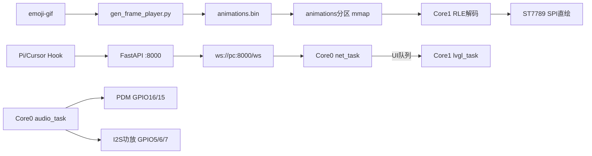
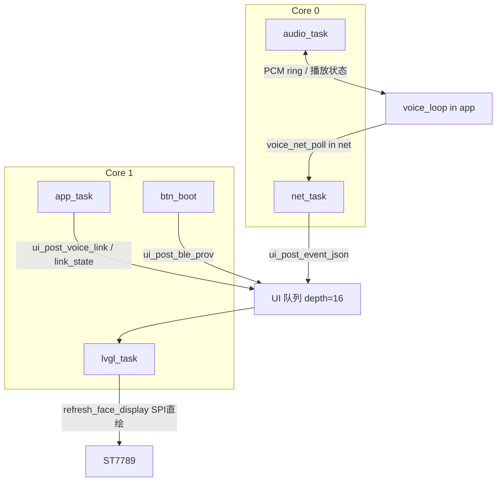
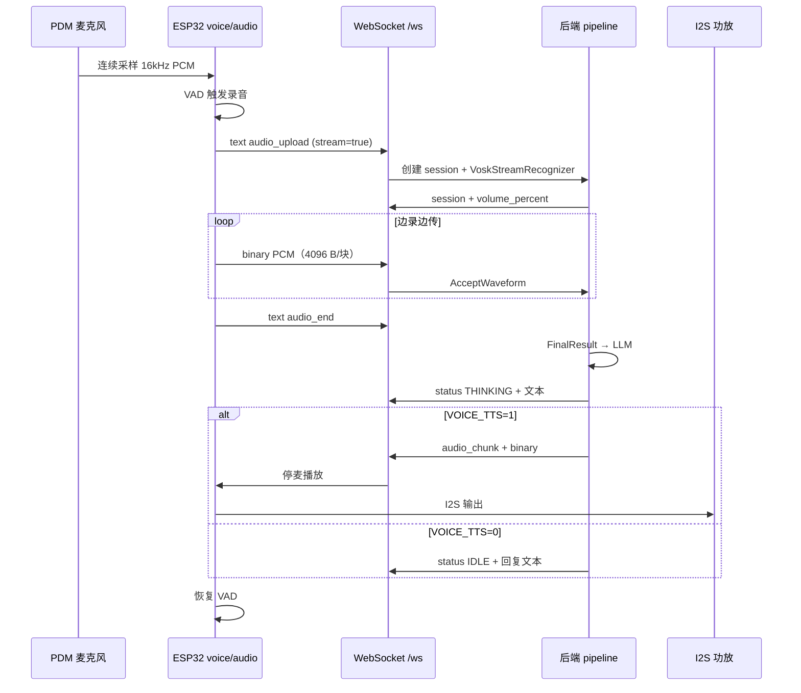

# ESP32-S3 Agent Display

ESP32-S3 N16R8 桌面状态屏：WebSocket 状态下行、离线 RGB565 RLE 表情、PDM 开机自动收听、PC 后端 ASR + LLM，网页日志带时间戳。

| 项 | 规格 |
|----|------|
| 固件框架 | ESP-IDF **5.4.2** + FreeRTOS + LVGL **9.2.2** |
| 通信 | WebSocket（`espressif/esp_websocket_client`） |
| 后端 | FastAPI + uvicorn，默认 `:8000` |

### 设计红线

1. **音频绑 Core 0**，优先级高于 LVGL；I2S 供数不及时会爆音、卡麦。
2. **任何非 `lvgl` 任务不得直接调用 LVGL API**；一律经 FreeRTOS 队列投递。
3. **表情用离线 RLE + Core 1 SPI 直绘**，设备端不启用 `lv_gif`。
4. **PDM DATA 用 GPIO16**，不要用 GPIO48（板载 WS2812）或 GPIO3（strapping）。
5. **LLM 密钥只放 `backend/.env`**，WiFi 凭据走 menuconfig / NVS，勿提交仓库。



---

## 目录

- [一、硬件](#一硬件)
  - [1.1 硬件架构](#11-硬件架构)
  - [1.2 引脚定义](#12-引脚定义)
  - [1.3 Flash 分区与内存占用](#13-flash-分区与内存占用)
  - [1.4 硬件与固件配置](#14-硬件与固件配置)
- [二、固件软件架构](#二固件软件架构)
  - [2.1 分层与模块](#21-分层与模块)
  - [2.2 启动流程](#22-启动流程)
  - [2.3 跨任务通信](#23-跨任务通信)
- [三、FreeRTOS 双核与任务分配](#三freertos-双核与任务分配)
  - [3.1 双核职责划分](#31-双核职责划分)
  - [3.2 应用任务一览](#32-应用任务一览)
  - [3.3 优先级与调度策略](#33-优先级与调度策略)
  - [3.4 IDF 系统任务与临时任务](#34-idf-系统任务与临时任务)
  - [3.5 内存分配策略](#35-内存分配策略)
  - [3.6 线程安全红线](#36-线程安全红线)
- [四、核心功能实现](#四核心功能实现)
  - [4.1 显示与 UI](#41-显示与-ui)
  - [4.2 表情动画（离线 RLE）](#42-表情动画离线-rle)
  - [4.3 中文字库](#43-中文字库)
  - [4.4 网络与 WebSocket](#44-网络与-websocket)
  - [4.5 语音交互](#45-语音交互)
  - [4.6 BLE 配网](#46-ble-配网)
- [五、后端服务](#五后端服务)
  - [5.1 架构与模块](#51-架构与模块)
  - [5.2 WebSocket 协议](#52-websocket-协议)
  - [5.3 语音处理流水线](#53-语音处理流水线)
  - [5.4 Agent Hook 集成](#54-agent-hook-集成)
- [六、构建与部署](#六构建与部署)
  - [6.1 依赖清单](#61-依赖清单)
  - [6.2 构建与烧录](#62-构建与烧录)
  - [6.3 仓库结构](#63-仓库结构)
- [附录](#附录)

---

## 一、硬件

### 1.1 硬件架构

| 子系统 | 规格 | 说明 |
|--------|------|------|
| 主控 | ESP32-S3 N16R8 | 双核 Xtensa LX7，**240 MHz** |
| Flash | 16 MB QIO 80 MHz | 自定义 `partitions.csv` |
| PSRAM | 8 MB OPI 80 MHz | `SPIRAM_USE_MALLOC`，大块缓冲优先放 PSRAM |
| 显示 | ST7789 240×240 | **SPI**（非 I2C），RGB565 16 bit |
| 麦克风 | PDM，I2S0 RX | 16 kHz / mono / 16 bit |
| 功放 | I2S1 TX，Philips | 16 kHz / 16 bit，播放侧写 stereo |
| 控制台 | USB Serial/JTAG | GPIO19 / GPIO20 |
| 按键 | BOOT（GPIO0） | 长按 BLE 配网 / 超长按诊断 |

音频格式：16 kHz 单声道 s16le；单段最长 15 s（VAD）/ 缓冲 20 s；播放 ring **512 KB**（PSRAM）。

### 1.2 引脚定义

#### ST7789 屏幕

| 信号 | GPIO |
|------|------|
| GND | GND |
| VCC / BLK | 3V3 |
| CS | 8 |
| DC | 9 |
| RST | 10 |
| SDA (MOSI) | 11 |
| SCL (SCLK) | 12 |

#### I2S 功放（I2S1 TX）

| 信号 | GPIO | 说明 |
|------|------|------|
| DIN | 5 | 数据 |
| LRCLK / WS | 6 | 左右声道时钟 |
| BCLK | 7 | 位时钟 |

功放 VCC 建议 **5V**（3V3 音量偏低），与 ESP、屏幕共地。

#### PDM 麦克风（I2S0 RX）

| 信号 | GPIO | 说明 |
|------|------|------|
| CLK | 15 | 仅在 `audio_task` 启动后开启 |
| DATA | **16** | 不用 GPIO3（strapping）或 GPIO48（板载 WS2812） |

无录音键：开机 VAD 自动收听。GPIO17 / 18 空闲备用。

#### 禁止占用

| GPIO | 原因 |
|------|------|
| 19 / 20 | 原生 USB Serial/JTAG |
| 26–32 | N16R8 OPI Flash / PSRAM |
| 45 / 46 | strapping（VDD_SPI / boot） |
| 48 | 板载 RGB LED |

GPIO3 在复位时会参与 strapping，接麦 DATA 可能干扰 USB 下载。

### 1.3 Flash 分区与内存占用

> 体积对应当前构建产物；分区定义见 `partitions.csv`。构建或烧录资源后若 bin 变化，请更新本节数字。

#### Flash — 16 MB

**占用排名（按文件大小降序）**

| 排名 | 分区 | 资源 | 文件 | 大小 | 占分区 | 占 Flash |
|------|------|------|------|------|--------|----------|
| 1 | animations | 表情 GIF → RLE 帧序列（mmap） | `firmware/data/animations.bin` | 4.41 MB | 73.4% | 27.5% |
| 2 | app0 | 主程序固件 | `build/esp32s3_agent_display.bin` | 1.38 MB | 46.0% | 8.6% |
| 3 | cjk_font | 中文字库 | `firmware/data/font_cjk_16.bin` | 893 KB | 43.6% | 5.4% |
| 4 | bootloader | 引导程序 | `build/bootloader/bootloader.bin` | 21.8 KB | 68.3% | 0.1% |
| 5 | otadata | OTA 槽位 | `build/ota_data_initial.bin` | 8.0 KB | 100% | 0.05% |
| 6 | partition-table | 分区表 | `build/partition_table/partition-table.bin` | 3.0 KB | 75.0% | 0.02% |

**未占用 / 运行时分区**

| 分区 | 偏移 | 容量 | 说明 |
|------|------|------|------|
| nvs | `0x009000` | 20 KB | BLE / `agent_cfg`、WiFi 等 |
| spiffs | `0x310000` | 896 KB | 遗留空 |
| coredump | `0x3F0000` | 64 KB | 崩溃转储 |
| storage | `0xC00000` | 4 MB | 预留 |

烧录：`scripts/flash_animations.py` → `0x600000`；`scripts/flash_font.py` → `0x400000`。

#### PSRAM — 8 MB

| 排名 | 占用项 | 源码 | 大小 | 占 PSRAM |
|------|--------|------|------|----------|
| 1 | CJK 字库运行时 | `main/font_loader.c` | 893 KB | 10.9% |
| 2 | 录音 PCM | `VOICE_MAX_RECORD_BYTES` | 640 KB | 7.6% |
| 3 | 播放 ring | `VOICE_PLAY_RING_BYTES` | 512 KB | 6.3% |
| 4 | 语音历史 | `VOICE_HISTORY_BYTES` | 128 KB | 1.6% |
| 5 | LVGL partial×2 | `PARTIAL_BUF_LINES=40` | 37.5 KB | 0.5% |

已知缓冲合计 ≈ **2.14 MB**（26.8%），空闲堆 ≈ **5.86 MB**。表情 RLE 双缓冲（≈32 KB）在**片内 DRAM**。

#### 片内 DRAM — 约 512 KB 可用池（示意）

| 排名 | 占用项 | 源码 / 配置 | 大小 |
|------|--------|-------------|------|
| 1 | 应用任务栈等 | FreeRTOS 各任务 | ≈80 KB |
| 2 | SPIRAM 预留片内 | `SPIRAM_MALLOC_RESERVE_INTERNAL=32768` | 32 KB |
| 3 | 表情双缓冲 BSS | `main/ui.c` `frame_buffer_a/b` | 32 KB |

NimBLE / WiFi DMA 为动态占用。配网前需 `wifi_deinit` 腾连续块，否则 BT controller 可能 `Malloc failed` 断言重启。

### 1.4 硬件与固件配置

`sdkconfig.defaults` 关键项：

| 配置 | 值 | 说明 |
|------|-----|------|
| `CONFIG_ESP_DEFAULT_CPU_FREQ_MHZ` | 240 | 必须 240 MHz |
| `CONFIG_SPIRAM_MODE_OCT` | y | OPI PSRAM |
| `CONFIG_SPIRAM_USE_MALLOC` | y | malloc 可走 PSRAM |
| `CONFIG_SPIRAM_MALLOC_RESERVE_INTERNAL` | 32768 | 保留片内给 DMA / BT |
| `CONFIG_FREERTOS_HZ` | 1000 | 1 ms tick |
| `CONFIG_LV_USE_GIF` | n | 禁用运行时 GIF |
| `CONFIG_LV_USE_CLIB_MALLOC` | y | CJK binfont 需大堆 |
| `CONFIG_AGENT_VOICE_HW` | y | 启用 PDM + 功放 |
| `CONFIG_BT_NIMBLE_MEM_ALLOC_MODE_EXTERNAL` | y | NimBLE 堆走 PSRAM |

menuconfig「Agent Display」：WiFi SSID/密码、静态 IP、`AGENT_WS_URL` 等。出厂默认可读 Kconfig；BLE 写入 NVS 后 **NVS 优先**。

---

## 二、固件软件架构

### 2.1 分层与模块

```text
┌─────────────────────────────────────────────────────────────┐
│  PC 后端 (FastAPI)  ←── WebSocket /ws ──→  net_ws.c         │
├─────────────────────────────────────────────────────────────┤
│  应用层   voice.c (VAD)  │  ui.c (LVGL)  │  ble_prov.c     │
├─────────────────────────────────────────────────────────────┤
│  服务层   audio.c  │  anim_loader.c  │  font_loader.c       │
├─────────────────────────────────────────────────────────────┤
│  驱动层   display.c (SPI/ST7789)  │  I2S PDM/功放  │  GPIO │
├─────────────────────────────────────────────────────────────┤
│  IDF      WiFi / lwIP / NimBLE / NVS / esp_timer           │
└─────────────────────────────────────────────────────────────┘
```

| 模块 | 文件 | 职责 |
|------|------|------|
| 入口 | `main.c` | `app_main` 初始化、创建任务 |
| 显示 | `display.c` | SPI 总线、ST7789、`display_blit_rgb565` 直绘 |
| UI | `ui.c` / `ui_msg.h` | LVGL 控件、消息队列、表情刷新、字幕 |
| 动画 | `anim_loader.c` | mmap `animations` 分区、帧表索引 |
| 字库 | `font_loader.c` | 从 `cjk_font` 分区加载 binfont |
| 网络 | `net_ws.c` | WiFi、WebSocket、语音上传/下行 |
| 音频 | `audio.c` | PDM 采集、AGC、I2S 播放 ring |
| 语音 | `voice.c` | VAD 状态机、边录边传、UI 叠加 |
| 配网 | `ble_prov.c` / `agent_cfg.c` | NimBLE NUS、NVS 持久化 |
| 按键 | `btn_boot.c` | BOOT 长按检测 |
| 内存 | `mem_utils.c` | `psram_malloc` / `dram_malloc`、诊断报告 |

### 2.2 启动流程

`app_main`（在 IDF **main 任务**上同步执行，Core 0）顺序：

1. `nvs_flash_init`
2. `anim_loader_init` — mmap 表情分区
3. `display_init` — SPI + ST7789 + LVGL display
4. `font_cjk_init` — 字库载入 PSRAM
5. `ui_init` — 创建 UI 队列与控件
6. `agent_cfg_load` — 读 NVS / Kconfig
7. `btn_boot_init` — 创建 `btn_boot` 任务
8. `net_init` — WiFi 栈（尚未建 `net_task` 循环）
9. `voice_init` — 分配 PSRAM 缓冲
10. `mem_report("boot")`
11. 创建四个常驻任务（见 [§3.2](#32-应用任务一览)）

此后 `app_main` 返回，main 任务进入空闲；业务逻辑由各 FreeRTOS 任务承担。

### 2.3 跨任务通信



| 通道 | 类型 | 生产者 | 消费者 | 说明 |
|------|------|--------|--------|------|
| UI 队列 | `xQueueCreate(16, ui_msg_t)` | `net_task` / `app_task` / `btn_boot` | `lvgl_task` | 唯一 LVGL 写入口 |
| 语音链路 | 函数调用 + 共享缓冲 | `voice.c` | `net_ws.c` / `audio.c` | 录音 PCM、上传块在 PSRAM |
| `voice_link` 合并 | `portENTER_CRITICAL` | `voice.c` | `ui.c` | 避免队列丢消息卡在 SPEAKING |
| WebSocket | `esp_websocket_client` 回调 | IDF 内部 | `net_task` 轮询 | 不在回调里直接刷 UI |

---

## 三、FreeRTOS 双核与任务分配

ESP32-S3 为 **双核**（`CONFIG_FREERTOS_UNICORE` 未启用）。应用任务一律 `xTaskCreatePinnedToCore(..., core_id)` 显式绑核。

### 3.1 双核职责划分

| 核心 | 定位 | 常驻负载 | 设计理由 |
|------|------|----------|----------|
| **Core 0** | 实时 I/O + 网络 | `audio_task`、`net_task`、WiFi、lwIP、（配网时）NimBLE Host | I2S DMA 与 WiFi 协议栈对抖动敏感；音频与网络同核减少跨核同步 |
| **Core 1** | 显示 + 应用逻辑 | `lvgl_task`、`app_task`、`btn_boot` | LVGL `lv_timer_handler`、RLE 解码、SPI `draw_bitmap` 集中在一核，避免与 I2S 争用 |

```text
Core 0                          Core 1
────────                        ────────
audio_task  (pri 6)             lvgl_task (pri 4)
  ├ I2S0 PDM RX                   ├ xQueueReceive → LVGL API
  └ I2S1 功放 TX                  ├ refresh_face_display()
net_task    (pri 4)               └ RLE 解码 + SPI 直绘 90×90
  ├ WiFi 事件
  ├ esp_websocket_client
  └ voice_net_poll()
WiFi / lwIP (IDF)               app_task  (pri 3)
NimBLE Host (按需)                ├ voice_loop() VAD
                                  ├ ui_tick_animation()
                                  ├ ble_prov_loop()
                                  └ link_state 周期投递
                                btn_boot  (pri 6)
                                  └ GPIO0 长按轮询
```

### 3.2 应用任务一览

创建位置：`main/main.c` `app_main` 末尾；`btn_boot` 在 `btn_boot_init`。

| 任务名 | 核心 | 优先级 | 栈 (B) | 周期 / 阻塞 | 职责 |
|--------|------|--------|--------|-------------|------|
| `audio` | **0** | **6** | 8192 | `audio_task_loop` + `vTaskDelay(5ms)` | I2S0 PDM 读入、AGC、录音缓冲写入；I2S1 播放出队；**播放期停麦** |
| `net` | **0** | **4** | 8192 | `net_loop` + `vTaskDelay(20ms)` | WiFi 连接/重连、`esp_websocket_client`、JSON 事件解析、`voice_net_poll` 流式上传 |
| `lvgl` | **1** | **4** | 8192 | `ui_loop_once` + `vTaskDelay(5ms)` | 排空 UI 队列、调用 LVGL、`refresh_face_display`、表情帧 SPI 直绘 |
| `app` | **1** | **3** | 8192 | `vTaskDelay(5ms)` | `voice_loop` VAD 状态机；动画 tick；`ble_prov_loop`；1 s 时钟、250 ms 链路状态投递 UI |
| `btn_boot` | **1** | **6** | 4096 | `vTaskDelay(20ms)` 轮询 | BOOT 按住 ≥3 s → BLE；≥5 s → 诊断覆盖层 |

**临时任务**（非常驻）：

| 任务名 | 核心 | 优先级 | 栈 | 触发 | 说明 |
|--------|------|--------|-----|------|------|
| `ble_start` | 未绑核 | 5 | 8192 | `btn_boot` 长按 | 调用 `ble_prov_start()` 后自删除 |
| `NimBLE Host` | IDF 默认 | — | 8192 | 首次 BLE 配网 | `nimble_port_freertos_init`；`CONFIG_BT_NIMBLE_HOST_TASK_STACK_SIZE` |

### 3.3 优先级与调度策略

FreeRTOS 优先级：**数值越大越优先**（ESP-IDF 默认可用范围通常 0–24，应用使用 3–6）。

```text
优先级 (高 → 低)

  6  audio_task ─────────  Core 0  I2S 实时供数，必须高于 LVGL
  6  btn_boot   ─────────  Core 1  按键响应（与 audio 不同核，不冲突）
  5  ble_start  (临时)
  4  net_task   ─────────  Core 0  WebSocket / WiFi
  4  lvgl_task  ─────────  Core 1  显示刷新
  3  app_task   ─────────  Core 1  VAD 决策（可容忍数 ms 抖动）
```

**为何音频 = 6、LVGL = 4？**  
`audio_task` 每 5 ms 从 I2S 取数；若优先级低于 `lvgl_task`，SPI 刷屏或 RLE 解码会饿死音频，导致 DMA 欠载、爆音。`app_task` 最低：VAD 以帧为单位（数十 ms），通过队列异步更新 UI 即可。

**同优先级：** `net_task` 与 `lvgl_task` 均为 4，分属不同核心，互不抢占。

**tick：** `CONFIG_FREERTOS_HZ=1000`，`vTaskDelay(1)` = 1 ms。`lvgl_task` / `app_task` 5 ms 循环 ≈ 200 Hz；`net_task` 20 ms ≈ 50 Hz 足够驱动 WS 与上传。

### 3.4 IDF 系统任务与临时任务

除上表外，IDF 自动创建（未绑核或内部绑核）：

| 任务 / 组件 | 栈配置 | 说明 |
|-------------|--------|------|
| `main` | `CONFIG_ESP_MAIN_TASK_STACK_SIZE=8192` | 跑 `app_main` 后闲置 |
| `tiT` (lwIP tcpip) | `CONFIG_LWIP_TCPIP_TASK_STACK_SIZE=4096` | TCP/IP 协议栈 |
| WiFi 任务 | IDF 内置 | 与 `net_task` 协作 |
| `esp_timer` | IDF 内置 | LVGL tick（5 ms）、按键时间戳 |
| Idle (×2) | — | 每核一个 |
| NimBLE Host | 8192 | 仅配网窗口内 |

BLE 配网特殊流程：`ensure_nimble()` 前调用 `net_pause_for_ble()`（`wifi_stop` + `wifi_deinit`）释放片内连续块；失败则 `net_resume_after_ble()`。NimBLE 内存走外部：`CONFIG_BT_NIMBLE_MEM_ALLOC_MODE_EXTERNAL=y`。

### 3.5 内存分配策略

| API | 能力位 | 用途 |
|-----|--------|------|
| `psram_malloc()` | `MALLOC_CAP_SPIRAM` | 录音 PCM、播放 ring、语音历史、CJK 字库、LVGL partial buffer |
| `dram_malloc()` | `MALLOC_CAP_DMA \| INTERNAL` | 需 DMA 的驱动缓冲 |
| `malloc()` | 先 internal ≤4 KB，否则 PSRAM | `CONFIG_SPIRAM_MALLOC_ALWAYSINTERNAL=4096` |

大块原则：**>4 KB 默认 PSRAM**；片内保留 32 KB 给 WiFi/BT DMA。表情 `frame_buffer_a/b`（90×90×2×2）故意放 **BSS 片内**，减轻 PSRAM 带宽争用。

启动后 `mem_report()` 输出 DRAM/PSRAM free 与 largest block；PC 发 `{"type":"debug"}` 或 **按住 BOOT ≥5 s** 可看屏幕诊断。

### 3.6 线程安全红线

**禁止：**

1. 非 `lvgl` 任务调用任何 LVGL API（`lv_label_set_text`、`lv_obj_create` 等）。
2. 在 ISR 中调用 LVGL。
3. 多任务无锁同时读写 PCM / 文本缓冲。
4. 把 I2S 读写放进 `lvgl_task`，或与 UI 共用一个低优先级循环。
5. 把 CJK 字库套到 `LV_SYMBOL` 图标上（图标继续用 Montserrat）。

**正确做法：**

- `app_task` / `net_task` 只 `ui_post_*` 投递队列；`lvgl_task` 独占 LVGL。
- 动画**计时**在 `app_task`（`ui_tick_animation`），**解码与刷屏**只在 `lvgl_task`（`refresh_face_display`）。
- `ui_post_voice_link()` 在临界区内合并 `voice_hold` / `overlay`，防止连续帧覆盖 `voice_hold=false`。
- 长文本不进队列体：语音历史用 PSRAM 指针；`ui_msg_t.json` 上限 **1024 B**。
- `source=VOICE` 的 WS 事件**只更新底部字幕**；中部 GIF/状态行由 `refresh_face_display()` 统一决定。Agent `status` 在 `voice_hold` 期间暂存 `agent_status`，结束后恢复。

---

## 四、核心功能实现

### 4.1 显示与 UI

- **LVGL 9.2**：`PARTIAL_BUF_LINES=40`，双 partial buffer（PSRAM），刷新周期 `CONFIG_LV_DEF_REFR_PERIOD=15` ms。
- **布局**：顶部来源行、中部 90×90 表情区、状态中文、底部语音字幕（最多 2 行）。
- **刷新优先级**（`refresh_face_display`）：

| 优先级 | 条件 | 显示 |
|--------|------|------|
| 1 | WS 未连接 | `OFFLINE` |
| 2 | `voice_hold=true` | `voice_overlay`（EAR / THINKING / SPEAKING） |
| 3 | 其它 | `agent_status`（Hook 推送） |

- **录音音量条**：仅 `voice_hold` + 监听 + `overlay=EAR` 时显示 80×4 绿色条。

### 4.2 表情动画（离线 RLE）

PC 将 GIF 展开、按背景 `#10151B` 预混合，编成 90×90 RGB565 RLE。设备 **禁止** `lv_gif`。

```text
mmap(animations) → gif_id 帧表 → Core1 RLE 解到双缓冲 → display_blit_rgb565
```

二进制（小端）：`magic "AGIF"` + version + anim_count + width/height；每套 `frame_count/table_off`；每帧 `duration_ms/rle_size/rle_off`；RLE `(count, hi, lo)` 重复。

当前：`ANIM_BIN_SIZE=3557266`，`ANIM_FACE_SIZE=90`，`ANIM_FRAME_COUNT=434`。

| gif_id | status | 中文 | 源文件 |
|--------|--------|------|--------|
| 0 | IDLE | 空闲 | `IDLE.gif` |
| 1 | THINKING | 思考中 | `THINKING.gif` |
| 2 | CODING | 编码中 | `CODING.gif` |
| 3 | READING | 读取中 | `READING.gif` |
| 4 | TESTING | 测试中 | `TESTING.gif` |
| 5 | WAITING | 等待中 | `WAITING.gif` |
| 6 | DONE | 已完成 | `DONE.gif` |
| 7 | ERROR | 错误 | `ERROR.gif` |
| 8 | OFFLINE | 离线 | `OFFLINE.gif` |
| 9 | STALE | 已过期 | `STALE.gif` |
| 10 | UNKNOWN | 未知 | `UNKNOWN.gif` |
| 11 | TOOL | 使用工具 | `TOOL.gif` |
| 12 | EAR | 收听中 | `EAR.gif` |
| 13 | SPEAKING | 播报中 | `SPEAKING.gif` |

重新生成：

```bash
python scripts/gen_frame_player.py
python scripts/flash_animations.py -p COMx
```

只烧 app、不烧 `animations.bin` → 有字无表情。

### 4.3 中文字库

独立分区 `cjk_font`（`0x400000`，2 MB）：通用字表 7000 字 + ASCII + 标点，16px / 4bpp，`simhei.ttf` 源。

```bash
python scripts/gen_cjk_font.py
python scripts/flash_font.py -p COMx
```

`font_cjk_init()` 拷贝约 900 KB 到 PSRAM；须 `CONFIG_LV_USE_CLIB_MALLOC`。未烧字库则中文退回 Montserrat。

### 4.4 网络与 WebSocket

- 组件：`espressif/esp_websocket_client`
- 连接后发 `{"type":"hello","role":"device","rssi":…}`；服务端 `ack` 含 `server_time`
- 断线约 **3 s** 重连（`WS_RECONNECT_MS`）
- `source`：`PI` / `CURSOR` / `VOICE` / `BOT` / `UNKNOWN`；设备来源行**不显示 `VOICE`**

通用帧类型见 [§5.2](#52-websocket-协议)。

### 4.5 语音交互



#### 设备端参数

| 项 | 值 |
|----|-----|
| 流式上传块 | 4096 B（≈128 ms） |
| 录音增益 | PDM AGC 3–10×，初始 5× |
| 播放增益 | `PLAY_GAIN_100 × volume_percent / 100` |
| 高通 + 低通 | `LP_ALPHA=0.7`；播放淡出 `FADE_SAMPLES=160` |

#### VAD 状态机（`main/voice.c`）

```text
LISTEN ──(越阈且 WS 已连接)──► RECORDING
RECORDING ──(静音/最长时长)──► UPLOADING
UPLOADING ──(流式结束或 bulk)──► WAIT_REPLY
WAIT_REPLY ──(audio_chunk)──► PLAYING
WAIT_REPLY ──(IDLE|ERROR / 超时)──► LISTEN
PLAYING ──(播完)──► LISTEN（冷却 800 ms）
```

| 常量 | 值 | 含义 |
|------|-----|------|
| `VAD_RMS_START_FLOOR` | 0.012 | 起始 RMS 下限 |
| `VAD_PEAK_START_FLOOR` | 0.060 | 起始 Peak 下限 |
| `VAD_NOISE_MULT` | 3.5 | 阈值 = max(floor, 噪声×倍数) |
| `VAD_SILENCE_MS` | 800 | 静音结束录音 |
| `VAD_MAX_MS` | 15000 | 单段最长 |
| `WAIT_REPLY_MS` | 55000 | 等待后端超时 |
| `MIN_CLIP_BYTES` | 6400 | 过短丢弃 |

#### 任务分工（语音相关）

| 任务 | 核心 | 职责 |
|------|------|------|
| `audio_task` | 0 | PDM 读入、录音缓冲、I2S 播放 |
| `net_task` | 0 | `voice_net_poll` 开流/推块/`audio_end` |
| `app_task` | 1 | `voice_loop` VAD、`post_voice_ui` |
| `lvgl_task` | 1 | 字幕、`refresh_face_display` |

#### 播放期行为

- 收到首个 `audio_chunk`：停 PDM，进 `PLAYING`；**无 barge-in**
- `resume_listen()` 须**先**切 `s_phase=LISTEN` 再 `post_voice_ui()`，否则 UI 误留 `SPEAKING`
- 末片无 `end`：播放环空后 **300 ms** 兜底恢复

语音 WebSocket 帧格式、后端流水线、环境变量见 [§5.2](#52-websocket-协议)、[§5.3](#53-语音处理流水线)。

#### 语音相关源码

| 路径 | 职责 |
|------|------|
| `main/voice.c` | VAD、边录边传、`voice_on_ws_lost` |
| `main/audio.c` | PDM、AGC、播放 ring |
| `main/net_ws.c` | `audio_upload` / binary / `audio_chunk` |
| `main/ui.c` | 字幕、PSRAM 历史、`refresh_face_display` |
| `backend/ws_manager.py` | WS hub、流式会话、音频泵 |
| `backend/voice_pipeline.py` | ASR → LLM → TTS |

### 4.6 BLE 配网

ESP32-S3 **仅 BLE**（NimBLE + Nordic UART Service）。Windows 系统蓝牙设置**不会**弹出配对框——用本仓库网页或 SerialTest（LE）。

#### 触发方式

| 操作 | 结果 |
|------|------|
| 长按 BOOT ≥ **3 s** | 蓝色蓝牙图标 → NimBLE 广播 `AgentDisplay` |
| 按住 BOOT ≥ **5 s** | 运行时诊断覆盖层（约 12 s） |
| 按住 BOOT → 短按 RST | 下载模式（strapping） |

配网窗口最长约 **5 分钟**；`APPLY` 成功后约 0.5 s 结束广播并重连 WiFi/WS。

#### NUS UUID

| 角色 | UUID |
|------|------|
| Service | `6E400001-B5A3-F393-E0A9-E50E24DCCA9E` |
| RX | `6E400002-…` |
| TX | `6E400003-…` |

#### 文本协议（UTF-8，`\n` 结尾）

```text
WIFI:<ssid>,<password>
HOST:<ip>:<port>
IP:<x.x.x.x>          # 可选静态 IP
MASK:<x.x.x.x>
GW:<x.x.x.x>
GET
APPLY
```

#### 网页配网

1. `pip install -r backend/requirements.txt`（含 `bleak`）
2. 打开 Dashboard → **BLE 配网**
3. 设备长按 BOOT → 扫描 → 填写 WiFi / 后端 →「写入并 APPLY」

| API | 说明 |
|-----|------|
| `GET /api/ble/status` | bleak 可用性、日志 |
| `POST /api/ble/scan` | 扫描设备 |
| `POST /api/ble/provision` | 写入并 APPLY |

实现：`backend/ble_prov.py`、`backend/dashboard.html`。

---

## 五、后端服务

### 5.1 架构与模块

目录 `backend/`，入口 `main.py`，默认 `0.0.0.0:8000`。

| 模块 | 职责 |
|------|------|
| `main.py` | WebSocket `/ws`、REST API、Hook 队列轮询 |
| `ws_manager.py` | 设备连接、`audio_upload`、TTS 泵、`push_append` |
| `voice_pipeline.py` | ASR → LLM →（可选）TTS 编排 |
| `voice_session.py` | 会话 PCM / 分片队列 |
| `asr.py` | Vosk 流式 `VoskStreamRecognizer` |
| `llm.py` | OpenAI 兼容 Chat Completions |
| `chat_context.py` | 多轮上下文 |
| `ble_prov.py` | 网页 BLE 配网 |
| `dashboard.html` | 状态推送、语音日志 |

启动 / 停止（仓库根目录）：

```bat
start.bat
stop.bat
```

### 5.2 WebSocket 协议

端点：`ws://<pc-ip>:8000/ws`

#### 通用帧

| type | 方向 | 说明 |
|------|------|------|
| `hello` / `ack` | 握手 | `ack.server_time` 可校时 |
| `ping` / `pong` | 双向 | 保活 |
| `status` | PC→ESP | `status` / `text` / `source` / `gif` / `time` |
| `config` | PC→ESP | 如 `volume_percent` |
| `error` | PC→ESP | 错误详情 |

#### 语音相关帧

**ESP → PC 流式上传（主路径）**

1. text `audio_upload`：`stream=true`, `audio_len=0`
2. 服务端回 `session` + `volume_percent`
3. 多帧 binary PCM（4096 B/块）
4. text `audio_end`

**ESP → PC 整段上传（回退）**：text `audio_upload`（含 `audio_len`）+ 单帧 binary。

**PC → ESP**

| type | 说明 |
|------|------|
| `session` | `session_id`（12 位 hex）、`volume_percent` |
| `status` | Agent / 语音状态；`source=VOICE` 时更新字幕逻辑 |
| `append` | 流式 ASR/LLM；`role=user|assistant`，`reset` 控制段落 |
| `audio_chunk` + binary | TTS 分片；`end=true` 表结束 |
| `debug` | 请求设备运行时诊断 JSON |

`volume_percent` 仅设备端增益生效；后端 TTS **不二次缩放 PCM**。

### 5.3 语音处理流水线

```text
audio_upload(stream) → VoiceSession + VoskStreamRecognizer
  → binary chunks → AcceptWaveform
  → audio_end → FinalResult
  → LLM 流式 → append 字幕
  → [VOICE_TTS] edge-tts → audio_chunk 泵送
  → IDLE (source=VOICE) 收尾
```

| 步骤 | 说明 |
|------|------|
| 过短 PCM | < 6400 B → `IDLE`「没听清，请再说一次」 |
| 忙控制 | `_voice_busy`；超时 `VOICE_BUSY_TIMEOUT_SEC=55` |
| 多轮 | `CHAT_CONTEXT_MAX_TURNS=8`，空闲 `CHAT_CONTEXT_IDLE_SEC=300` 清空 |

#### 环境变量（`backend/.env`）

| 变量 | 说明 | 默认 |
|------|------|------|
| `LLM_BASE_URL` / `LLM_API_KEY` / `LLM_MODEL` | LLM 接口 | 见 `.env.example` |
| `VOICE_TTS` | TTS 开关 | `0` |
| `TTS_VOICE` / `TTS_RATE` | edge-tts 参数 | `zh-CN-XiaoxiaoNeural` / `+20%` |
| `ASR_ENGINE` | 识别引擎 | `vosk` |
| `VOSK_MODEL_PATH` | Vosk 模型目录 | `backend/models/vosk-model-small-cn-0.22` |

#### 异常与并发

| 场景 | 行为 |
|------|------|
| WS 未连接 | VAD 不录音 |
| 流式开流失败 | 回退整段 `audio_upload` |
| WS 断开 | `voice_on_ws_lost()`；UI `OFFLINE`，保留 `agent_status` 缓存 |
| WS 重连 | `_sync_device_state` 恢复 Cursor/Pi 表情 |
| 后端忙 | `voice pipeline busy` |
| 播放中 | 停麦；异 `session_id` chunk 丢弃 |

可选 HTTP：`POST /voice/upload`、`GET /voice/audio/{id}`、`POST /api/volume`。

### 5.4 Agent Hook 集成

Hook 装在**用户目录**，对所有仓库生效；**不要**在本仓库再放 `.cursor/hooks.json`。

| Agent | 路径 |
|-------|------|
| Pi | `%USERPROFILE%\.pi\agent\extensions\agent-display.ts` |
| Cursor | `%USERPROFILE%\.cursor\hooks.json`、`hooks\agent_display_hook.py` |

Cursor：写入 `event_queue.jsonl`，后端每 100 ms 清空；`source=CURSOR`。Pi：`source=PI`；30 s 无事件 → `STALE`。

#### 状态总表

| 状态 | 中文 | GIF | Pi | Cursor |
|------|------|-----|----|--------|
| IDLE | 空闲 | IDLE.gif | `session_start` | `sessionStart` |
| THINKING | 思考中 | THINKING.gif | `agent_start` / MCP | `beforeSubmitPrompt` / `afterAgentThought` |
| CODING | 编码中 | CODING.gif | `edit` / `write` | Write 类 `preToolUse` |
| READING | 读取中 | READING.gif | `read` | Read / Grep / Glob |
| TESTING | 测试中 | TESTING.gif | `bash` | Shell |
| WAITING | 等待中 | WAITING.gif | `agent_settled` | `stop` / AskQuestion |
| DONE | 已完成 | DONE.gif | `agent_end` | `afterAgentResponse` |
| ERROR | 错误 | ERROR.gif | 失败 `tool_result` | `postToolUseFailure` |
| OFFLINE | 离线 | OFFLINE.gif | `session_shutdown` | `sessionEnd` |
| STALE | 已过期 | STALE.gif | 30 s 无事件 | — |
| TOOL | 使用工具 | TOOL.gif | 工具调用 | `preToolUse` |
| EAR / SPEAKING | 收听/播报 | EAR / SPEAKING.gif | — | 语音 `voice_overlay` |

Cursor **不要**注册 `beforeAgentResponse`（3.x 非法事件名会导致 hooks 加载失败）。

---

## 六、构建与部署

### 6.1 依赖清单

#### 固件（ESP-IDF 5.4.2）

`main/idf_component.yml` 自动下载：

| 组件 | 版本 |
|------|------|
| `lvgl/lvgl` | 9.2.2 |
| `espressif/esp_websocket_client` | 1.8.0 |

#### PC 脚本

| 脚本 | 依赖 |
|------|------|
| `scripts/gen_frame_player.py` | Python 3 + Pillow |
| `scripts/gen_cjk_font.py` | Python 3 + Node.js + `lv_font_conv` |
| `scripts/flash_*.py` | esptool（IDF 自带或 pip） |

#### 后端 Python 3.10+

```bash
cd backend && pip install -r requirements.txt
```

| 包 | 用途 |
|----|------|
| `fastapi` / `uvicorn` | Web + WS |
| `httpx` | LLM API |
| `vosk` | 默认 ASR |
| `edge-tts` / `miniaudio` | TTS |
| `bleak` | 网页 BLE 配网 |

复制 `backend/.env.example` → `backend/.env`，填写 `LLM_API_KEY` 等。

### 6.2 构建与烧录

需 ESP-IDF 5.4.2。Git Bash 下 `export.sh` 可能失败，可用 `scripts/idf_build.bat`。详细环境见 [开发环境搭建.md](docs/开发环境搭建.md)。

```bat
scripts\idf_build.bat build
idf.py -p COMx flash
python scripts/flash_font.py -p COMx
python scripts/flash_animations.py -p COMx
idf.py -p COMx monitor
```

字库与表情分区可单独更新，不必每次全量 flash。

### 6.3 仓库结构

```text
esp32s3-agent-display/
├── README.md
├── start.bat / stop.bat
├── partitions.csv
├── sdkconfig.defaults
├── docs/
│   └── 开发环境搭建.md
├── backend/                 FastAPI + Dashboard + ASR/LLM + BLE
├── main/                    固件源码
├── scripts/                 构建、动画、字库、烧录
├── third_party/emoji-gif/   状态 GIF 源
├── third_party/fonts/       通用字表
└── firmware/data/           animations.bin / font_cjk_16.bin
```

---

## 附录

### Emoji 来源

[Noto Emoji Animation](https://googlefonts.github.io/noto-emoji-animation/) → `third_party/emoji-gif/` → `gen_frame_player.py`。

### GIF 裁切

[SkyloongGIFsHelper](https://github.com/PuddingTower/SkyloongGIFsHelper) 按 90×90 裁切后放入 `third_party/emoji-gif/`。

### Vosk 中文模型

1. 从 [Vosk Models](https://alphacephei.com/vosk/models) 下载 **vosk-model-small-cn-0.22**
2. 解压到 `backend/models/vosk-model-small-cn-0.22/`
3. 或设置 `VOSK_MODEL_PATH`

模型约 40 MB；`backend/models/` 已 gitignore。
