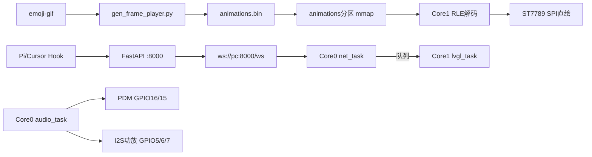

# ESP32-S3 Agent Display

ESP32-S3 N16R8 桌面状态屏：WebSocket 状态下行、离线 RGB565 RLE 表情、PDM 开机自动收听、PC 后端 ASR + LLM，网页日志带时间戳。

框架：ESP-IDF 5.4.2 + FreeRTOS + LVGL 9.2.2。通信使用 WebSocket。

一句话红线：**音频绑 Core 0 且优先级高于 LVGL；任何任务不得直接碰 LVGL，一律走 FreeRTOS 队列；表情用离线 RLE 在 Core 1 SPI 直绘，不要跑 `lv_gif`；PDM DATA 用 GPIO16，不要用 GPIO48 / GPIO3。**



---

## 硬件

| 项 | 规格 |
|----|------|
| 模组 | ESP32-S3 N16R8（双核 Xtensa 240 MHz） |
| Flash | 16 MB QIO 80 MHz |
| PSRAM | 8 MB OPI 80 MHz，`SPIRAM_USE_MALLOC` |
| 屏幕 | ST7789 240×240，SPI（不是 I2C） |
| 麦 | PDM，I2S0 RX |
| 功放 | I2S1 TX，Philips，16 kHz / 16 bit / mono |
| 控制台 | USB Serial/JTAG（GPIO19/20） |

menuconfig 必须：CPU **240 MHz**、双核（非 unicore）、OPI PSRAM、自定义 `partitions.csv`。LVGL 颜色 16 bit，**不要**启用运行时 GIF。语音硬件默认开：`CONFIG_AGENT_VOICE_HW`。

WiFi SSID、密码、静态 IP 与 WebSocket 后端地址在 menuconfig「Agent Display」中配置，不要把密钥提交进仓库。LLM 密钥只放 `backend/.env`。

### 分区（16 MB）与占用

整片 Flash 16 MB。分区定义见 `partitions.csv`。**已用**指当前实际烧进去的镜像大小；NVS / coredump 为运行时写入，表中标「运行时」。

启动区（不在 csv 里，偏移 0x0）：bootloader **22,208 B** / 32 KB 槽（IDF 计 **32% 空闲**）。

| 分区 | 偏移 | 容量 | 已用 | 占用 | 存什么 | 状态 |
|------|------|------|------|------|--------|------|
| nvs | 0x9000 | 20 KB | 运行时 | — | WiFi、校准、IDF 键值 | 系统 |
| otadata | 0xE000 | 8 KB | 8,192 B | 100% | OTA 槽位选择 | 已烧录初始 otadata |
| app0 | 0x10000 | 3 MB | **1,683,616 B**（1.61 MB） | **54%** | 固件、`font_cjk_16` 一级汉字库、业务代码 | 已烧录；余 1,462,112 B（46%） |
| spiffs | 0x310000 | 896 KB | 0 | 0% | 遗留 SPIFFS，当前未挂载 | 空闲（遗留） |
| coredump | 0x3F0000 | 64 KB | 运行时 | — | 崩溃转储 | 空闲，崩溃时写入 |
| voice_font | 0x400000 | 2 MB | 0 | 0% | 旧语音 bin 字库槽；一级字已编进 app | 空闲 |
| animations | 0x600000 | 6 MB | **3,557,266 B**（3.39 MB） | **57%** | 表情 RGB565 RLE（`animations.bin`） | 已烧录；余约 2.61 MB |
| storage | 0xC00000 | 4 MB | 0 | 0% | 预留用户数据 / 后续资源 | 空闲预留 |

app 内 `font_cjk_16` 位图 `.rodata.glyph_bitmap` = `0x669d1`（约 410 KB），加 glyph 描述后字库约 **446 KB**，计入上面的 1.61 MB app，不再占 `voice_font` 分区。

整片当前**已烧录镜像合计约 5.03 MB / 16 MB**（bootloader + 表 + otadata + app + animations）。

`scripts/flash_animations.py` 写偏移 **0x600000**。运行时 `esp_partition_find_first(DATA, 0x98, "animations")` + mmap。

### 烧录镜像

全量烧录需依次写入以下镜像（偏移见上表）：

| 镜像 | 偏移 |
|------|------|
| bootloader.bin | 0x0 |
| partition-table.bin | 0x8000 |
| ota_data_initial.bin | 0xE000 |
| esp32s3_agent_display.bin | 0x10000 |
| animations.bin | 0x600000 |

串口端口以本机检测结果为准（如 `COMx`）。烧录后需复位；未烧 `animations.bin` 则有字无表情。

---

## 引脚

### ST7789

| 信号 | GPIO |
|------|------|
| GND | GND |
| VCC / BLK | 3V3 |
| CS | 8 |
| DC | 9 |
| RST | 10 |
| SDA (MOSI) | 11 |
| SCL (SCLK) | 12 |

### 功放（I2S1 TX）

| 信号 | GPIO |
|------|------|
| DIN | 5 |
| LRCLK / WS | 6 |
| BCLK | 7 |

功放 VCC 建议 5V（3V3 音量偏低），与 ESP、屏幕共地。

### PDM 麦克风（I2S0 RX）

| 信号 | GPIO | 说明 |
|------|------|------|
| CLK | 15 | 只在 `app_main` 之后、`audio_task` 里开启 |
| DATA | **16** | 不用 GPIO3（strapping）也不用 48（板载 WS2812） |

无录音键：开机 VAD 自动收听。GPIO17 / 18 空闲备用。

GPIO3 复位采样会在 USB Serial/JTAG 与官方 JTAG 间切换，麦 DATA 接 3 可能干扰下载。

### 禁止占用

| GPIO | 原因 |
|------|------|
| 19 / 20 | 原生 USB |
| 26–32 | N16R8 OPI Flash/PSRAM |
| 45 / 46 | strapping（VDD_SPI / boot） |
| 48 | 板载 RGB LED |

音频：16 kHz 单声道 16 bit PCM；单段上限约 10 s；播放 ring 32 KB（PSRAM）。


---

## ESP 核绑定与任务

一律 `xTaskCreatePinnedToCore()`，最后一个参数为核心 ID（0 或 1）。

**优先级：音频 > LVGL > 后端逻辑。** 音频低于 LVGL 会导致 I2S 供数不及时、爆音、卡麦。

| 任务 | 核心 | 优先级 | 栈 | 职责 |
|------|------|--------|----|------|
| `audio_task` | Core 0 | **6** | 4096 | I2S0 PDM RX + I2S1 功放 TX，环形缓冲 |
| `net_task` | Core 0 | 4 | 8192 | WiFi、`esp_websocket_client`、语音上传 |
| `lvgl_task` | Core 1 | 4 | 8192 | `lv_timer_handler` + 队列取消息；RLE 解码与 SPI 直绘 |
| `app_task` | Core 1 | 3 | 4096 | 状态机 / VAD 决策，只 `xQueueSend` 到 LVGL 队列 |

### 线程安全红线

禁止：

1. 非 LVGL 任务调用任何 LVGL API（`lv_label_set_text`、`lv_obj_create`、`lv_gif_set_src` 等）。
2. 在 ISR 里调 LVGL。
3. 多任务无锁同时读写 PCM / 文本缓冲区。
4. 把 I2S 读写放进 `lvgl_task`，或与网络塞进同一个低优先级循环。
5. 把 CJK 字库套到 `LV_SYMBOL` 图标上（图标继续用 Montserrat）。

正确做法：`app_task` / `net_task` 只投递队列；`lvgl_task` 用 `lv_timer`（约 30 ms）非阻塞 `xQueueReceive`。长文本不塞进队列项，传指针或 ID。录音 PCM、播放 ring、大缓冲：`heap_caps_malloc(..., MALLOC_CAP_SPIRAM)`。动画**计时**可在 `app_task`，**解码与刷屏**只在 Core 1。

`source=VOICE` 时不覆盖中部 Agent 状态行，只更新底部语音行。

---

## 表情：离线 RLE，设备端不用 lv_gif

PC 把 GIF 展开、按背景 `#10151B` 预混合，编成 90×90 RGB565 RLE。设备 **禁止** 启用 `lv_gif` / 经 `lv_image` 刷表情。

```text
mmap(animations 分区) → 按 gif_id 取帧表 → Core1 RLE 解到双缓冲 → SPI 直绘 90×90
```

二进制（小端）：`magic "AGIF"` + version + anim_count + width/height；每套动画 `frame_count/table_off`；每帧 `duration_ms/rle_size/rle_off`；RLE 为 `(count, rgb565_hi, rgb565_lo)` 重复。

当前产物：`ANIM_BIN_SIZE=3557266`，`ANIM_FACE_SIZE=90`，`ANIM_FRAME_COUNT=434`。

| gif_id | status | 中文 | 源文件 |
|--------|--------|------|--------|
| 0 | IDLE | 空闲 | `IDLE.gif` |
| 1 | THINKING | 思考中 | `THINKING.gif` |
| 2 | CODING | 编码中 | `CODING.gif` |
| 3 | READING | 读取中 | `READING.gif` |
| 4 | TESTING | 测试中 | `TESTING.gif` |
| 5 | WAITING | 等待中 | `WAITING.gif` |
| 6 | DONE | 已完成 | `DONE.gif` |
| 7 | ERROR | 错误 | `ERROR.gif` |
| 8 | OFFLINE | 离线 | `OFFLINE.gif` |
| 9 | STALE | 已过期 | `STALE.gif` |
| 10 | UNKNOWN | 未知 | `UNKNOWN.gif` |

`TOOL.gif` 在目录里，**不进入** `animations.bin` 索引。重新生成：

```bash
python scripts/gen_frame_player.py
python scripts/flash_animations.py -p COMx
```

依赖 Pillow。只烧 app、不烧 `animations.bin` 则有字无表情。

---

## 中文字库

开机即用 `font_cjk_16`：《通用规范汉字表》一级 3500 字 + ASCII `0x20-0x7F` + 常用中文标点，16px / 4bpp，源字体 `simhei.ttf`。重新生成：`python scripts/gen_cjk_font.py`（需 npx + `lv_font_conv`）。不要用 `0x4E00-0x9FFF` 整段代替一级字。

---

## WebSocket 协议

组件 `espressif/esp_websocket_client`。

连上后 ESP 发 `{"type":"hello","role":"device","rssi":-58}`，服务端回 `{"type":"ack","role":"device","server_time":...}`。断线约 3 s 重连。

| type | 方向 | 帧 | 说明 |
|------|------|----|------|
| `hello` / `ack` | 握手 | text | `ack` 含 `server_time` 可校时 |
| `ping` / `pong` | 双向 | text | 保活 |
| `status` | PC→ESP | text | `status` / `text` / `source` / `gif` / `time` |
| `audio_upload` | ESP→PC | text + 下一帧 binary PCM | 16 kHz mono s16le |
| `session` | PC→ESP | text | `session_id` |
| `audio_chunk` | PC→ESP | text + binary | TTS 分片，每片 ≤1024；`len=0` 可无 binary |
| `error` | PC→ESP | text | 错误 |

语音必须「text 元数据 → binary」。`source`：`PI` / `CURSOR` / `VOICE` / `BOT` / `UNKNOWN`。

VAD：连上 WS 后听环境声，峰值触发录音，静音约 1.5 s 或满 10 s 上传，然后继续听。

```text
ESP → audio_upload + PCM
PC  → session
PC  → Vosk ASR → 网页日志（用户，YYYY-MM-DD HH:MM:SS）
PC  → 2api.store gpt-5.6-luna → 网页日志（助手，带时间）
PC  → status 更新设备语音行
```

TTS 默认关（`VOICE_TTS=1` 才开）。LLM 密钥在 `backend/.env`，接口见 [2api.store](https://2api.store)。


---

## 后端架构

目录 `backend/`，FastAPI + uvicorn。入口 `backend/main.py`。

| 模块 | 作用 |
|------|------|
| `main.py` | WebSocket `/ws`、Hook 队列轮询、语音日志 |
| `ws_manager.py` | 设备 WS 连接管理；`audio_upload` 收 PCM |
| `asr.py` | 默认 Vosk 中文（`vosk-model-small-cn-0.22`） |
| `llm.py` | OpenAI 兼容 Chat Completions |
| `voice_pipeline.py` | ASR → LLM（可选 TTS） |
| `voice_session.py` | 会话与 TTS 分片 |
| `dashboard.html` | 状态推送、状态历史、语音识别日志（用户/助手 + 时间） |
| `.env` | `LLM_BASE_URL` / `LLM_API_KEY` / `LLM_MODEL`（已 gitignore） |

默认监听 `0.0.0.0:8000`。设备通过 `ws://<pc-ip>:8000/ws` 连接。

启动 / 停止（于仓库根目录执行，成功或失败都会打完日志再退出）：

```bat
start.bat
stop.bat
```

依赖：`pip install -r backend/requirements.txt`。

---

## 源项目 Hooks

Hook 装在**用户目录**，对所有仓库生效。**不要**再在本仓库放 `.cursor/hooks.json`，否则会重复触发、状态互盖。

| Agent | 路径 |
|-------|------|
| Pi | `%USERPROFILE%\.pi\agent\extensions\agent-display.ts` |
| Cursor | `%USERPROFILE%\.cursor\hooks.json`、`hooks\agent_display_hook.py`、`hooks\agent_display_hook.ps1` |

Pi：`source=PI`；30 秒无事件发 `STALE`。  
Cursor：写入 `%USERPROFILE%\.cursor\hooks\event_queue.jsonl`，后端每 100 ms 读取清空。运行中每 2 s 写 `backend_online.json`，停止时删除；Hook 见文件不存在则不入队。`source=CURSOR`。PowerShell 包装器先读 stdin 再交给 Python。

Cursor 3.x **不要**注册 `beforeAgentResponse`，非法事件名会导致整份 `hooks.json` 加载失败。

诊断：Cursor `View → Output → Hooks`；`%TEMP%\agent_display_hook_trace.log` / `agent_display_hook_errors.log`。

### 状态总表

| 状态 | 中文 | GIF | Pi | Cursor |
|------|------|-----|----|--------|
| IDLE | 空闲 | IDLE.gif | `session_start` | `sessionStart` |
| THINKING | 思考中 | THINKING.gif | `agent_start`；成功 `tool_result`；工具名含 mcp | `beforeSubmitPrompt`；`afterAgentThought`；`postToolUse`；未识别 / Task / MCP 的 `preToolUse` |
| CODING | 编码中 | CODING.gif | `edit` / `write` | Write 类 `preToolUse`；`afterFileEdit` |
| READING | 读取中 | READING.gif | `read` | Read / Grep / Glob / WebFetch 等 |
| TESTING | 测试中 | TESTING.gif | `bash` | Shell / Bash |
| WAITING | 等待中 | WAITING.gif | `agent_settled`；approval/confirm | `stop`；AskQuestion / SwitchMode |
| DONE | 已完成 | DONE.gif | `agent_end` | `afterAgentResponse` |
| ERROR | 错误 | ERROR.gif | 失败 `tool_result` | `postToolUseFailure` |
| OFFLINE | 离线 | OFFLINE.gif | `session_shutdown` | `sessionEnd` |
| STALE | 已过期 | STALE.gif | 30 秒无事件 | 无对应 Hook |
| UNKNOWN | 未知 | UNKNOWN.gif | 未识别工具 | 未识别工具归 THINKING |

Cursor 注册事件：`sessionStart` `beforeSubmitPrompt` `preToolUse` `postToolUse` `postToolUseFailure` `afterAgentThought` `afterAgentResponse` `afterFileEdit` `stop` `sessionEnd`。

`preToolUse` / `tool_call` 带 `status_detail=tool_running`。

---

## 构建与烧录

需 ESP-IDF 5.4.2 环境。Git Bash 下 `export.sh` 可能因 MSYS 失败，可在仓库根目录使用 `_idf_build.bat` 包装构建。

于项目根目录执行：

```bat
_idf_build.bat build
idf.py -p COMx flash
python scripts/flash_animations.py -p COMx
idf.py -p COMx monitor
```

PowerShell 下先加载本机 ESP-IDF 环境配置，再 `cd` 到本项目根目录，执行与上相同的 `idf.py` / `python scripts/...` 命令。

---

## 仓库结构

```text
esp32s3-agent-display/
├── README.md
├── start.bat / stop.bat          后端启停（打完日志退出）
├── _idf_build.bat
├── partitions.csv
├── sdkconfig.defaults
├── backend/                      FastAPI + Dashboard + ASR/LLM
├── main/                         固件（ui / net_ws / audio / voice / font_cjk_16）
├── scripts/                      动画、字库、烧录
├── third_party/emoji-gif/        状态 GIF
├── third_party/fonts/            一级字表
└── firmware/data/animations.bin
```

---

## 附录

### Emoji 来源

表情 GIF 来自 Google Fonts 的 **Noto Emoji Animation**（Noto 彩色表情动画），站点：

- https://googlefonts.github.io/noto-emoji-animation/

本仓库 `third_party/emoji-gif/` 是按 Agent 状态挑选、裁剪后的拷贝，供 `scripts/gen_frame_player.py` 打成 `animations.bin`。上游许可以该站点及 Noto Emoji 项目说明为准。

### GIF 裁切工具

将原始 GIF 按目标分辨率（如 90×90）裁切时，可使用 [SkyloongGIFsHelper](https://github.com/PuddingTower/SkyloongGIFsHelper)。该工具基于 PyQt5 + Pillow，支持按指定宽高比框选裁切区域并批量导出，裁切结果放入 `third_party/emoji-gif/` 后再运行 `scripts/gen_frame_player.py` 生成 `animations.bin`。
