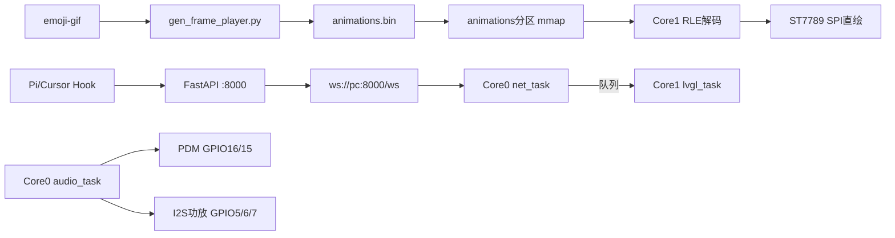
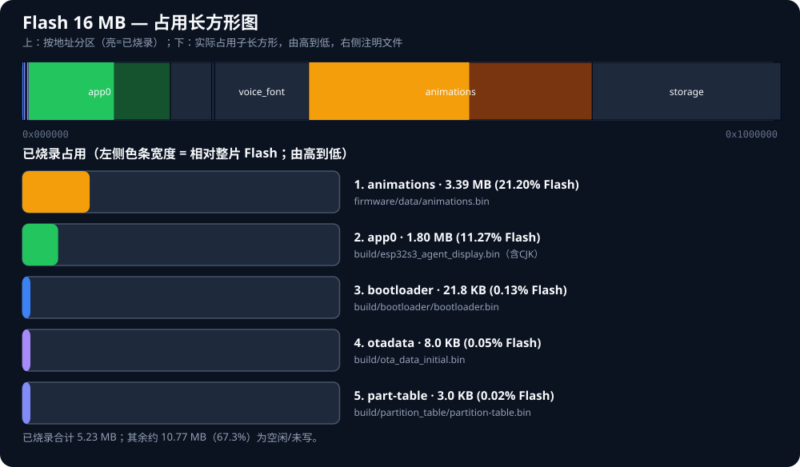
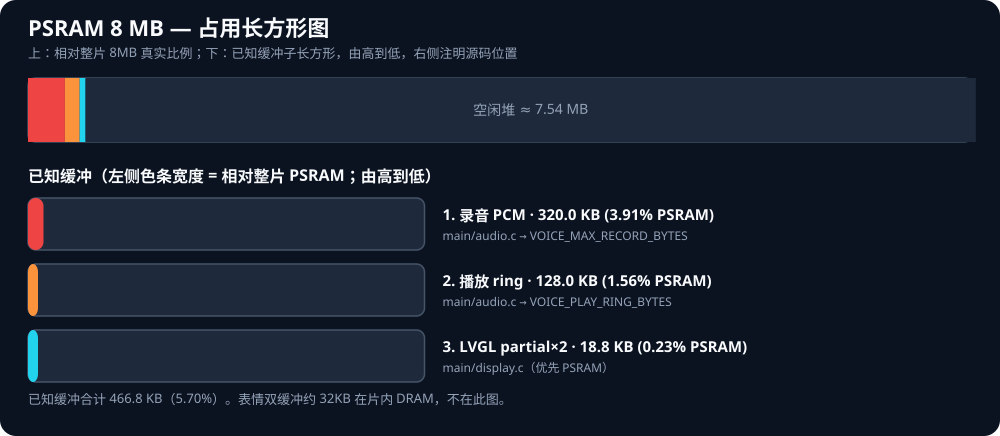
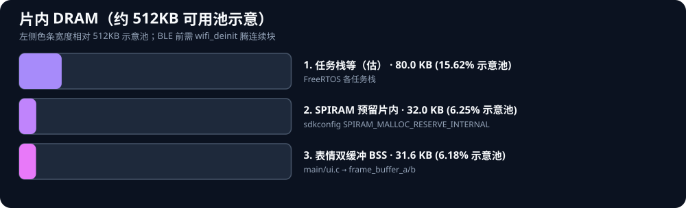

# ESP32-S3 Agent Display

ESP32-S3 N16R8 桌面状态屏：WebSocket 状态下行、离线 RGB565 RLE 表情、PDM 开机自动收听、PC 后端 ASR + LLM，网页日志带时间戳。

框架：ESP-IDF 5.4.2 + FreeRTOS + LVGL 9.2.2。通信使用 WebSocket。

一句话红线：**音频绑 Core 0 且优先级高于 LVGL；任何任务不得直接碰 LVGL，一律走 FreeRTOS 队列；表情用离线 RLE 在 Core 1 SPI 直绘，不要跑 `lv_gif`；PDM DATA 用 GPIO16，不要用 GPIO48 / GPIO3。**



---

## 依赖

### 固件构建（ESP-IDF）

| 项 | 要求 |
|----|------|
| [ESP-IDF](https://docs.espressif.com/projects/esp-idf/) | **5.4.2** |
| 目标芯片 | ESP32-S3（N16R8） |
| Python | 3.8+（随 ESP-IDF 提供，供 `idf.py` / `esptool` 使用） |

IDF 组件由 `main/idf_component.yml` 声明，首次 `idf.py build` 时自动下载到 `managed_components/`：

| 组件 | 版本约束 | 当前锁定 |
|------|----------|----------|
| `lvgl/lvgl` | ^9.2.2 | 9.2.2 |
| `espressif/esp_websocket_client` | ^1.4.0 | 1.8.0 |

### PC 脚本工具

用于生成资源、单独烧录表情分区（非固件编译必需，改 GIF / 字库时需要）：

| 脚本 | 依赖 | 安装 |
|------|------|------|
| `scripts/gen_frame_player.py` | Python 3 + Pillow | `pip install Pillow` |
| `scripts/gen_cjk_font.py` | Python 3 + Node.js（`npx`）+ `lv_font_conv`；系统 TTF（如黑体） | 安装 [Node.js](https://nodejs.org/) 后首次运行由 `npx` 拉取 `lv_font_conv` |
| `scripts/flash_animations.py` | Python 3 + esptool | 优先使用 ESP-IDF 自带；亦可 `pip install esptool` |

### 后端 Python

Python **3.10+** 推荐。于 `backend/` 目录安装：

```bash
pip install -r requirements.txt
```

`backend/requirements.txt` 包列表：

| 包 | 用途 |
|----|------|
| `fastapi` | Web 框架、WebSocket `/ws` |
| `uvicorn` | ASGI 服务（`start.bat` 启动） |
| `httpx` | 调用 OpenAI 兼容 LLM API |
| `vosk` | 默认离线 ASR |
| `SpeechRecognition` | 可选引擎 `ASR_ENGINE=google` |
| `python-dotenv` | 读取 `backend/.env` |

环境变量模板见 `backend/.env.example`，复制为 `backend/.env` 并填写 `LLM_API_KEY`：

| 变量 | 说明 | 默认 |
|------|------|------|
| `LLM_BASE_URL` | OpenAI 兼容接口根地址 | （必填，见 `backend/.env.example`） |
| `LLM_API_KEY` | API 密钥 | （必填） |
| `LLM_MODEL` | 模型标识 | （必填，见 `backend/.env.example`） |
| `VOICE_TTS` | 是否启用 TTS 回传 | `0`（关） |
| `ASR_ENGINE` | 识别引擎 | `vosk` |
| `VOSK_MODEL_PATH` | Vosk 模型目录 | `backend/models/vosk-model-small-cn-0.22` |

默认 ASR 需自行下载 Vosk 中文模型，见「附录 → Vosk 中文模型」。

可选 ASR：`ASR_ENGINE=google` 使用 `SpeechRecognition` 在线识别；`ASR_ENGINE=faster_whisper` 需额外 `pip install faster-whisper`。

---

## 硬件

| 项 | 规格 |
|----|------|
| 模组 | ESP32-S3 N16R8（双核 Xtensa 240 MHz） |
| Flash | 16 MB QIO 80 MHz |
| PSRAM | 8 MB OPI 80 MHz，`SPIRAM_USE_MALLOC` |
| 屏幕 | ST7789 240×240，SPI（不是 I2C） |
| 麦 | PDM，I2S0 RX |
| 功放 | I2S1 TX，Philips，16 kHz / 16 bit / mono |
| 控制台 | USB Serial/JTAG（GPIO19/20） |

menuconfig 必须：CPU **240 MHz**、双核（非 unicore）、OPI PSRAM、自定义 `partitions.csv`。LVGL 颜色 16 bit，**不要**启用运行时 GIF。语音硬件默认开：`CONFIG_AGENT_VOICE_HW`。

WiFi SSID、密码、静态 IP 与 WebSocket 后端地址在 menuconfig「Agent Display」中配置，不要把密钥提交进仓库。LLM 密钥只放 `backend/.env`。

### 存储占用图（Flash / PSRAM / 片内 DRAM）

下面三张图比表格更直观：

1. **上部总览条**：整片介质按真实比例（Flash 按地址；PSRAM 按缓冲 + 空闲堆）
2. **下方子长方形**：每项一行，色条宽度 = 相对整片占比，**由高占用到低**
3. **右侧文字**：名称、大小、占比，以及对应**文件 / 源码位置**







> 图片：`docs/flash_usage.svg` / `psram_usage.svg` / `dram_usage.svg`。体积变化后可运行 `python scripts/gen_mem_svg.py` 重新生成。  
> 当前镜像体积：app ≈ **1.80 MB**，`animations.bin` ≈ **3.39 MB**（烧录偏移 `0x600000`）。

#### Flash 分区速查表

| 分区 | 偏移 | 容量 | 已用 | 文件 / 内容 |
|------|------|------|------|-------------|
| bootloader | `0x000000` | 32 KB | 21.8 KB | `build/bootloader/bootloader.bin` |
| partition-table | `0x008000` | 4 KB | 3.0 KB | `build/partition_table/partition-table.bin` |
| nvs | `0x009000` | 20 KB | 运行时 | BLE/`agent_cfg`、WiFi 等 NVS |
| otadata | `0x00E000` | 8 KB | 8.0 KB | `build/ota_data_initial.bin` |
| **app0** | `0x010000` | **3 MB** | **1.80 MB** | `build/esp32s3_agent_display.bin`（含 CJK） |
| spiffs | `0x310000` | 896 KB | 0 | 遗留空 |
| coredump | `0x3F0000` | 64 KB | 运行时 | 崩溃转储 |
| voice_font | `0x400000` | 2 MB | 0 | 旧字库槽（空） |
| **animations** | `0x600000` | **6 MB** | **3.39 MB** | `firmware/data/animations.bin`（mmap） |
| storage | `0xC00000` | 4 MB | 0 | 预留 |

分区定义：`partitions.csv`。烧录动画：`scripts/flash_animations.py` → `0x600000`。

#### 运行时缓冲速查

| 缓冲 | 介质 | 大小 | 源码 |
|------|------|------|------|
| 录音 PCM | **PSRAM** | 320 KB | `main/audio.c` `VOICE_MAX_RECORD_BYTES` |
| 播放 ring | **PSRAM** | 128 KB | `main/audio.c` `VOICE_PLAY_RING_BYTES` |
| LVGL partial×2 | **PSRAM（优先）** | ≈19 KB | `main/display.c` `PARTIAL_BUF_LINES=20` |
| 表情双缓冲 | **片内 DRAM** | ≈32 KB | `main/ui.c` BSS |
| NimBLE/WiFi DMA | **片内 DRAM** | 动态 | 配网前 `wifi_deinit` 腾连续块 |

## BLE 配网（实现说明）

ESP32-S3 **仅 BLE**（无经典蓝牙 SPP）。配网使用 **NimBLE + Nordic UART Service（NUS）**；Windows 系统「蓝牙设置」里通常**不会**弹出配对框，也**搜不到/配不上**——请用本仓库网页或 SerialTest（LE）。

### 触发方式

| 操作 | 结果 |
|------|------|
| 运行中**长按 BOOT ≥ 3 秒**（不要按 RST） | 进入配网：广播名 `AgentDisplay`，屏幕大号蓝色蓝牙图标 |
| 按住 BOOT → 短按 RST | 下载模式（strapping），与配网无关 |

配网窗口最长约 **5 分钟**；`APPLY` 成功后约 0.5 s 结束广播并重连 WiFi/WS。

### 固件实现要点

| 模块 | 文件 | 作用 |
|------|------|------|
| 按键 | `main/btn_boot.c` | 独立任务轮询 GPIO0；按住满 3 s 即触发（不必等松手） |
| BLE | `main/ble_prov.c` | 用户触发后才 `nimble_port_init`；NUS RX 收行、TX notify 回执 |
| 配置 | `main/agent_cfg.c` | NVS 存 SSID/密码/`ws_url`/可选静态 IP·掩码·网关 |
| 网络 | `main/net_ws.c` | 进 BLE 前 `net_pause_for_ble()`（`wifi_stop`+`wifi_deinit`）腾片内 RAM；结束后 `net_resume_after_ble()` |
| UI | `main/ui.c` | `UI_MSG_BLE_PROV` 时画蓝牙标志并暂停 GIF 刷新 |

**为何必须先拆 WiFi：** 与 WiFi 并存时片内连续空闲往往不足 10 KB，BT controller `Malloc failed` 会断言重启。实测 `wifi_deinit` 后 internal largest 可到 ~30 KB+，NimBLE 才能起来。LVGL 刷图缓冲也改为**优先 PSRAM**，避免占掉 BT 所需 DRAM。

NUS UUID（标准 Nordic UART）：

| 角色 | UUID |
|------|------|
| Service | `6E400001-B5A3-F393-E0A9-E50E24DCCA9E` |
| RX（手机/PC → 设备，Write / Write NR） | `6E400002-…` |
| TX（设备 → 手机/PC，Notify） | `6E400003-…` |

### 文本协议（UTF-8，行尾 `\n`）

```text
WIFI:<ssid>,<password>
HOST:<ip>:<port>
IP:<x.x.x.x>          # 可选，设备静态 IP；空则 DHCP（或沿用 NVS/Kconfig）
MASK:<x.x.x.x>        # 可选，子网掩码
GW:<x.x.x.x>          # 可选，网关/DNS
GET
APPLY
```

| 命令 | 设备应答示例 | 说明 |
|------|--------------|------|
| `WIFI:…` | `OK wifi` | 写入内存中的 SSID/密码 |
| `HOST:…` | `OK host` | 写成 `ws://<ip>:<port>/ws` |
| `IP:` / `MASK:` / `GW:` | `OK ip` / `OK mask` / `OK gw` | 可选静态地址；仅当 `IP` 非空时 APPLY 后走静态 |
| `GET` | `OK ssid=… host=… ip=… mask=… gw=…` | 不回传 WiFi 密码 |
| `APPLY` | `OK apply` | `agent_cfg_save` → `net_apply_config` 重连 |

出厂默认仍可读 menuconfig 的 WiFi/WS/静态 IP；BLE 写入 NVS 后优先用 NVS。

### 推荐：网页配网（后端 Python + bleak）

SerialTest 在部分 Windows 上连接会崩溃，故后端用 [bleak](https://github.com/hbldh/bleak) 直连 GATT，控制台填表下发。

1. `pip install -r backend/requirements.txt`（含 `bleak`）
2. **重启后端**后打开控制台 → **BLE 配网** 卡片  
3. 设备长按 BOOT 出蓝牙图标 →「扫描 AgentDisplay」→ 填 WiFi / 后端 IP:端口（及可选 IP/掩码/网关）→「写入并 APPLY」

| API | 说明 |
|-----|------|
| `GET /api/ble/status` | bleak 是否可用、建议本机 IP、最近日志 |
| `POST /api/ble/scan` | `{"timeout":6}` → 设备列表 |
| `POST /api/ble/provision` | `ssid` / `password` / `host` / `port` / 可选 `address` / `ip` / `netmask` / `gateway` |

实现文件：`backend/ble_prov.py`、`backend/main.py`、控制台 `backend/dashboard.html`。

**Windows 注意：** 不会弹出系统蓝牙配对请求；不要在「设置 → 蓝牙」里找 `AgentDisplay`。本机蓝牙保持开启即可。

### 备选：SerialTest（Bluetooth LE）

与下载模式不冲突。用 [SerialTest](https://github.com/wh201906/SerialTest) 选 **Bluetooth LE**，编码 UTF-8，Suffix 勾选 `\n`，按上行协议发送。若点击连接即崩溃，请改用网页配网。

## 引脚

### ST7789

| 信号 | GPIO |
|------|------|
| GND | GND |
| VCC / BLK | 3V3 |
| CS | 8 |
| DC | 9 |
| RST | 10 |
| SDA (MOSI) | 11 |
| SCL (SCLK) | 12 |

### 功放（I2S1 TX）

| 信号 | GPIO |
|------|------|
| DIN | 5 |
| LRCLK / WS | 6 |
| BCLK | 7 |

功放 VCC 建议 5V（3V3 音量偏低），与 ESP、屏幕共地。

### PDM 麦克风（I2S0 RX）

| 信号 | GPIO | 说明 |
|------|------|------|
| CLK | 15 | 只在 `app_main` 之后、`audio_task` 里开启 |
| DATA | **16** | 不用 GPIO3（strapping）也不用 48（板载 WS2812） |

无录音键：开机 VAD 自动收听。GPIO17 / 18 空闲备用。

GPIO3 复位采样会在 USB Serial/JTAG 与官方 JTAG 间切换，麦 DATA 接 3 可能干扰下载。

### 禁止占用

| GPIO | 原因 |
|------|------|
| 19 / 20 | 原生 USB |
| 26–32 | N16R8 OPI Flash/PSRAM |
| 45 / 46 | strapping（VDD_SPI / boot） |
| 48 | 板载 RGB LED |

音频：16 kHz 单声道 16 bit PCM；单段上限约 10 s；播放 ring 128 KB（PSRAM）。


---

## ESP 核绑定与任务

一律 `xTaskCreatePinnedToCore()`，最后一个参数为核心 ID（0 或 1）。

**优先级：音频 > LVGL > 后端逻辑。** 音频低于 LVGL 会导致 I2S 供数不及时、爆音、卡麦。

| 任务 | 核心 | 优先级 | 栈 | 职责 |
|------|------|--------|----|------|
| `audio_task` | Core 0 | **6** | 4096 | I2S0 PDM RX + I2S1 功放 TX，环形缓冲 |
| `net_task` | Core 0 | 4 | 8192 | WiFi、`esp_websocket_client`、语音上传 |
| `lvgl_task` | Core 1 | 4 | 8192 | `lv_timer_handler` + 队列取消息；RLE 解码与 SPI 直绘 |
| `app_task` | Core 1 | 3 | 4096 | 状态机 / VAD 决策，只 `xQueueSend` 到 LVGL 队列 |

### 线程安全红线

禁止：

1. 非 LVGL 任务调用任何 LVGL API（`lv_label_set_text`、`lv_obj_create`、`lv_gif_set_src` 等）。
2. 在 ISR 里调 LVGL。
3. 多任务无锁同时读写 PCM / 文本缓冲区。
4. 把 I2S 读写放进 `lvgl_task`，或与网络塞进同一个低优先级循环。
5. 把 CJK 字库套到 `LV_SYMBOL` 图标上（图标继续用 Montserrat）。

正确做法：`app_task` / `net_task` 只投递队列；`lvgl_task` 用 `lv_timer`（约 30 ms）非阻塞 `xQueueReceive`。长文本不塞进队列项，传指针或 ID。录音 PCM、播放 ring、大缓冲：`heap_caps_malloc(..., MALLOC_CAP_SPIRAM)`。动画**计时**可在 `app_task`，**解码与刷屏**只在 Core 1。

`source=VOICE` 时不覆盖中部 Agent 状态行，只更新底部语音行。

---

## 表情：离线 RLE，设备端不用 lv_gif

PC 把 GIF 展开、按背景 `#10151B` 预混合，编成 90×90 RGB565 RLE。设备 **禁止** 启用 `lv_gif` / 经 `lv_image` 刷表情。

```text
mmap(animations 分区) → 按 gif_id 取帧表 → Core1 RLE 解到双缓冲 → SPI 直绘 90×90
```

二进制（小端）：`magic "AGIF"` + version + anim_count + width/height；每套动画 `frame_count/table_off`；每帧 `duration_ms/rle_size/rle_off`；RLE 为 `(count, rgb565_hi, rgb565_lo)` 重复。

当前产物：`ANIM_BIN_SIZE=3557266`，`ANIM_FACE_SIZE=90`，`ANIM_FRAME_COUNT=434`。

| gif_id | status | 中文 | 源文件 |
|--------|--------|------|--------|
| 0 | IDLE | 空闲 | `IDLE.gif` |
| 1 | THINKING | 思考中 | `THINKING.gif` |
| 2 | CODING | 编码中 | `CODING.gif` |
| 3 | READING | 读取中 | `READING.gif` |
| 4 | TESTING | 测试中 | `TESTING.gif` |
| 5 | WAITING | 等待中 | `WAITING.gif` |
| 6 | DONE | 已完成 | `DONE.gif` |
| 7 | ERROR | 错误 | `ERROR.gif` |
| 8 | OFFLINE | 离线 | `OFFLINE.gif` |
| 9 | STALE | 已过期 | `STALE.gif` |
| 10 | UNKNOWN | 未知 | `UNKNOWN.gif` |

`TOOL.gif` 在目录里，**不进入** `animations.bin` 索引。重新生成：

```bash
python scripts/gen_frame_player.py
python scripts/flash_animations.py -p COMx
```

脚本依赖见「依赖 → PC 脚本工具」。只烧 app、不烧 `animations.bin` 则有字无表情。

---

## 中文字库

开机即用 `font_cjk_16`：《通用规范汉字表》一级 3500 字 + ASCII `0x20-0x7F` + 常用中文标点，16px / 4bpp，源字体 `simhei.ttf`。重新生成：`python scripts/gen_cjk_font.py`（依赖见「依赖 → PC 脚本工具」）。不要用 `0x4E00-0x9FFF` 整段代替一级字。

---

## WebSocket 协议

组件 `espressif/esp_websocket_client`。

连上后 ESP 发 `{"type":"hello","role":"device","rssi":-58}`，服务端回 `{"type":"ack","role":"device","server_time":...}`。断线约 3 s 重连。

| type | 方向 | 帧 | 说明 |
|------|------|----|------|
| `hello` / `ack` | 握手 | text | `ack` 含 `server_time` 可校时 |
| `ping` / `pong` | 双向 | text | 保活 |
| `status` | PC→ESP | text | `status` / `text` / `source` / `gif` / `time` |
| `audio_upload` | ESP→PC | text + binary | 语音上传，见 [VOICE.md](docs/VOICE.md) |
| `session` | PC→ESP | text | 语音会话 ID |
| `audio_chunk` / `append` | PC→ESP | text + binary 或 text | TTS 分片 / LLM 流式字幕 |
| `config` | PC→ESP | text | 如 `volume_percent` |
| `error` | PC→ESP | text | 错误 |

`source`：`PI` / `CURSOR` / `VOICE` / `BOT` / `UNKNOWN`。

**语音全流程**（VAD 参数、双帧协议、ASR/LLM/TTS 流水线、环境变量）见 **[VOICE.md](docs/VOICE.md)**。


---

## 后端架构

目录 `backend/`，FastAPI + uvicorn。入口 `backend/main.py`。

| 模块 | 作用 |
|------|------|
| `main.py` | WebSocket `/ws`、Hook 队列轮询、语音日志 |
| `ws_manager.py` | 设备 WS 连接管理；`audio_upload` 收 PCM |
| `asr.py` | 默认 Vosk 中文（`vosk-model-small-cn-0.22`） |
| `llm.py` | OpenAI 兼容 Chat Completions |
| `voice_pipeline.py` | ASR → LLM（可选 TTS） |
| `voice_session.py` | 会话与 TTS 分片 |
| `dashboard.html` | 状态推送、状态历史、语音识别日志（用户/助手 + 时间） |
| `.env` | `LLM_BASE_URL` / `LLM_API_KEY` / `LLM_MODEL`（已 gitignore） |

默认监听 `0.0.0.0:8000`。设备通过 `ws://<pc-ip>:8000/ws` 连接。

启动 / 停止（于仓库根目录执行，成功或失败都会打完日志再退出）：

```bat
start.bat
stop.bat
```

后端依赖与环境变量见「依赖 → 后端 Python」。

---

## 源项目 Hooks

Hook 装在**用户目录**，对所有仓库生效。**不要**再在本仓库放 `.cursor/hooks.json`，否则会重复触发、状态互盖。

| Agent | 路径 |
|-------|------|
| Pi | `%USERPROFILE%\.pi\agent\extensions\agent-display.ts` |
| Cursor | `%USERPROFILE%\.cursor\hooks.json`、`hooks\agent_display_hook.py`、`hooks\agent_display_hook.ps1` |

Pi：`source=PI`；30 秒无事件发 `STALE`。  
Cursor：写入 `%USERPROFILE%\.cursor\hooks\event_queue.jsonl`，后端每 100 ms 读取清空。运行中每 2 s 写 `backend_online.json`，停止时删除；Hook 见文件不存在则不入队。`source=CURSOR`。PowerShell 包装器先读 stdin 再交给 Python。

Cursor 3.x **不要**注册 `beforeAgentResponse`，非法事件名会导致整份 `hooks.json` 加载失败。

诊断：Cursor `View → Output → Hooks`；`%TEMP%\agent_display_hook_trace.log` / `agent_display_hook_errors.log`。

### 状态总表

| 状态 | 中文 | GIF | Pi | Cursor |
|------|------|-----|----|--------|
| IDLE | 空闲 | IDLE.gif | `session_start` | `sessionStart` |
| THINKING | 思考中 | THINKING.gif | `agent_start`；成功 `tool_result`；工具名含 mcp | `beforeSubmitPrompt`；`afterAgentThought`；`postToolUse`；未识别 / Task / MCP 的 `preToolUse` |
| CODING | 编码中 | CODING.gif | `edit` / `write` | Write 类 `preToolUse`；`afterFileEdit` |
| READING | 读取中 | READING.gif | `read` | Read / Grep / Glob / WebFetch 等 |
| TESTING | 测试中 | TESTING.gif | `bash` | Shell / Bash |
| WAITING | 等待中 | WAITING.gif | `agent_settled`；approval/confirm | `stop`；AskQuestion / SwitchMode |
| DONE | 已完成 | DONE.gif | `agent_end` | `afterAgentResponse` |
| ERROR | 错误 | ERROR.gif | 失败 `tool_result` | `postToolUseFailure` |
| OFFLINE | 离线 | OFFLINE.gif | `session_shutdown` | `sessionEnd` |
| STALE | 已过期 | STALE.gif | 30 秒无事件 | 无对应 Hook |
| UNKNOWN | 未知 | UNKNOWN.gif | 未识别工具 | 未识别工具归 THINKING |

Cursor 注册事件：`sessionStart` `beforeSubmitPrompt` `preToolUse` `postToolUse` `postToolUseFailure` `afterAgentThought` `afterAgentResponse` `afterFileEdit` `stop` `sessionEnd`。

`preToolUse` / `tool_call` 带 `status_detail=tool_running`。

---

## 构建与烧录

需 ESP-IDF 5.4.2 环境。Git Bash 下 `export.sh` 可能因 MSYS 失败，可用 `scripts/idf_build.bat` 包装构建。更完整的本机安装步骤见 [开发环境搭建.md](docs/开发环境搭建.md)。

于项目根目录执行：

```bat
scripts\idf_build.bat build
idf.py -p COMx flash
python scripts/flash_animations.py -p COMx
idf.py -p COMx monitor
```

PowerShell 下先加载本机 ESP-IDF 环境配置，再 `cd` 到本项目根目录，执行与上相同的 `idf.py` / `python scripts/...` 命令。

---

## 仓库结构

```text
esp32s3-agent-display/
├── README.md
├── start.bat / stop.bat          后端启停（打完日志退出）
├── partitions.csv
├── sdkconfig.defaults
├── docs/                         文档与占用示意图
│   ├── VOICE.md                  语音收听→识别→回复全流程
│   ├── 开发环境搭建.md
│   └── *_usage.svg               Flash / PSRAM / DRAM 图
├── backend/                      FastAPI + Dashboard + ASR/LLM
├── main/                         固件（ui / net_ws / audio / voice / font_cjk_16）
├── scripts/                      构建包装、动画、字库、烧录、内存图生成
├── third_party/emoji-gif/        状态 GIF
├── third_party/fonts/            一级字表
└── firmware/data/animations.bin
```

---

## 附录

### Emoji 来源

表情 GIF 来自 Google Fonts 的 **Noto Emoji Animation**（Noto 彩色表情动画），站点：

- https://googlefonts.github.io/noto-emoji-animation/

本仓库 `third_party/emoji-gif/` 是按 Agent 状态挑选、裁剪后的拷贝，供 `scripts/gen_frame_player.py` 打成 `animations.bin`。上游许可以该站点及 Noto Emoji 项目说明为准。

### GIF 裁切工具

将原始 GIF 按目标分辨率（如 90×90）裁切时，可使用 [SkyloongGIFsHelper](https://github.com/PuddingTower/SkyloongGIFsHelper)。该工具基于 PyQt5 + Pillow，支持按指定宽高比框选裁切区域并批量导出，裁切结果放入 `third_party/emoji-gif/` 后再运行 `scripts/gen_frame_player.py` 生成 `animations.bin`。

### Vosk 中文模型

后端默认 ASR（`ASR_ENGINE=vosk`）需要离线语音模型，仓库不包含该文件（`backend/models/` 已 gitignore）。

1. 从 [Vosk Models](https://alphacephei.com/vosk/models) 下载 **vosk-model-small-cn-0.22**
2. 解压到 `backend/models/vosk-model-small-cn-0.22/`（解压后该目录下应含 `am/`、`conf/`、`graph/` 等子目录）
3. 若放在其他路径，在 `backend/.env` 中设置 `VOSK_MODEL_PATH` 指向模型根目录

模型约 40 MB，首次启动后端时会加载；未放置模型时语音识别将报错。
