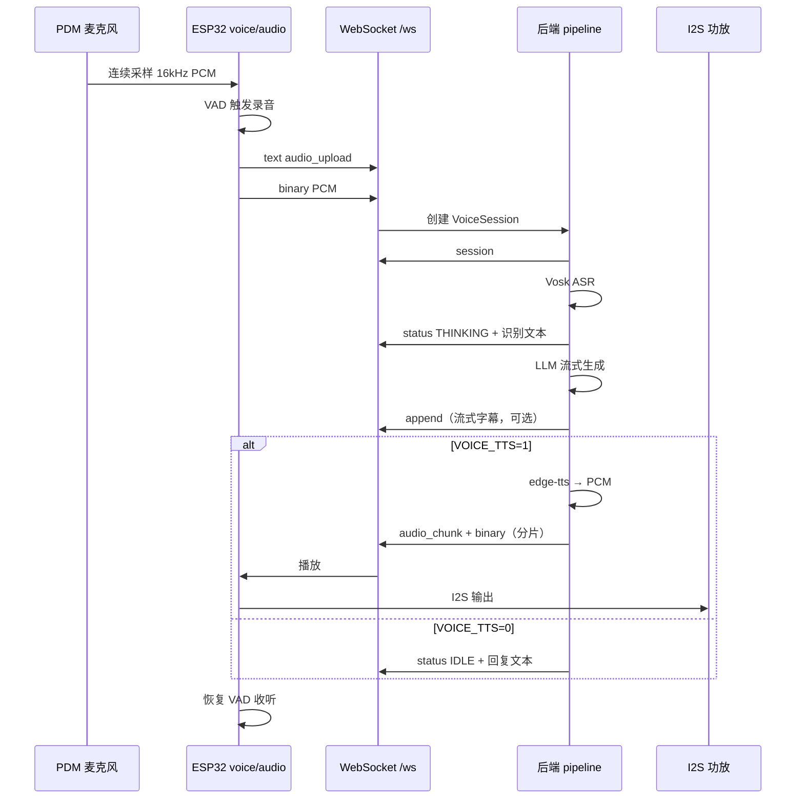

# 语音交互：收听 → 识别 → 回复

本文描述 ESP32 端连续收听（VAD）、WebSocket 上传 PCM、PC 后端 ASR / LLM / TTS 与回传播放的完整流程、协议字段与可调参数。通用 WebSocket 握手与 Agent 状态帧见 [README.md](README.md)。



---

## 1. 总览

| 环节 | 位置 | 说明 |
|------|------|------|
| 采集 | ESP `audio_task`（Core 0） | PDM → 16 kHz / mono / s16le |
| VAD / 状态机 | ESP `app_task` → `voice_loop` | 无按键，开机即听 |
| 上传 | ESP `net_task` → `voice_net_poll` | WebSocket 双帧：元数据 + PCM |
| 会话 | 后端 `voice_session` | 内存会话，默认 60 s 超时 |
| ASR | 后端 `asr.py` | 默认 Vosk 离线中文 |
| LLM | 后端 `llm.py` | OpenAI 兼容 Chat Completions（流式） |
| TTS | 后端 `voice_pipeline.py` | 可选 `edge-tts` + `miniaudio` 解码 |
| 下行音频 | 后端 `ws_manager.run_session_pump` | `audio_chunk` 分片推送 |
| 播放 | ESP `audio_task` | 环形缓冲 → I2S 功放 |

**红线**：录音与播放 I2S 在 Core 0、`audio_task` 优先级 **6**（高于 LVGL）；VAD 决策在 Core 1 `app_task`，通过队列更新 UI，不直接调用 LVGL。

---

## 2. 设备端

### 2.1 硬件与音频格式

| 项 | 值 |
|----|-----|
| 麦克风 | PDM，I2S0 RX，CLK=GPIO15，DATA=**GPIO16** |
| 功放 | I2S1 TX，Philips，DIN=5 / WS=6 / BCLK=7 |
| 采样率 | 16 kHz |
| 声道 | 1（mono） |
| 位深 | 16 bit signed little-endian |
| 最大录音时长 | 10 s（`VOICE_MAX_RECORD_BYTES` = 320 000 B） |
| 播放环形缓冲 | 32 KB（`VOICE_PLAY_RING_BYTES`） |
| 播放增益 | 固件内 `PLAY_GAIN_100=4`；再乘 `volume_percent`（默认 100%） |

menuconfig `CONFIG_AGENT_VOICE_HW` 关闭时，整条语音链路不编译运行。

### 2.2 任务分工

| 任务 | 核心 | 语音相关职责 |
|------|------|----------------|
| `audio_task` | 0 | PDM 读入、峰值/RMS、录音缓冲、I2S 播放出队 |
| `net_task` | 0 | `voice_net_poll()` 发送 `audio_upload` |
| `app_task` | 1 | `voice_loop()` VAD 状态机、UI 状态投递 |
| `lvgl_task` | 1 | 显示语音行；`source=VOICE` 时不覆盖中部 Agent 状态行 |

### 2.3 VAD 状态机

`main/voice.c` 中阶段与转换：

```text
LISTEN ──(检测到语音且 WS 已连接)──► RECORDING
RECORDING ──(静音超时或达到最长时长)──► UPLOADING
UPLOADING ──(上传完成)──► WAIT_REPLY
WAIT_REPLY ──(收到 TTS 播放 / 服务端 IDLE|ERROR / 本地超时)──► LISTEN
任意阶段 ──(收到 audio_chunk)──► PLAYING ──(播完)──► LISTEN
```

| 常量 | 值 | 含义 |
|------|-----|------|
| `VAD_PEAK_START` | 1400 | 起始峰值阈值下限 |
| `VAD_RMS_START` | 280 | 起始 RMS 阈值下限 |
| `VAD_PEAK_HOLD` | 480 | 录音中「仍在说话」峰值下限 |
| `VAD_RMS_HOLD` | 90 | 录音中「仍在说话」RMS 下限 |
| `VAD_MIN_MS` | 500 | 最短有效录音 |
| `VAD_SILENCE_MS` | 900 | 静音多久结束录音 |
| `VAD_MAX_MS` | 6000 | 单段最长录音 |
| `VAD_COOLDOWN_MS` | 1500 | 丢弃短片段后的冷却 |
| `MIN_CLIP_BYTES` | 12 800 | 低于此长度丢弃（约 0.4 s） |
| `WAIT_REPLY_MS` | 25 000 | 等待后端回复超时 |

阈值会随环境噪声自适应：`start_peak_th = max(VAD_PEAK_START, noise_peak×5+350)` 等（见 `voice.c`）。

### 2.4 设备 UI 状态（`source=VOICE`）

| 阶段 | `status` | 底部语音行文案 |
|------|----------|----------------|
| 开始录音 | `THINKING` | 正在聆听 |
| 上传中 | `THINKING` | 正在上传 |
| 等待回复 | `THINKING` | 正在思考 |
| 失败 | `ERROR` | 上传失败 / 服务端错误 |
| 仅文本回复（无 TTS） | `IDLE` | LLM 全文 |
| 流式生成中 | `THINKING` | 通过 `append` 增量刷新 |

---

## 3. WebSocket 协议（语音相关）

端点：`ws://<pc-ip>:8000/ws`。设备连接后首帧：

```json
{"type":"hello","role":"device","rssi":-58}
```

服务端回：

```json
{"type":"ack","role":"device","server_time":1735689600}
```

### 3.1 ESP → PC：上传语音

**帧 1（text）`audio_upload`**

```json
{
  "type": "audio_upload",
  "sample_rate": 16000,
  "channels": 1,
  "bit_depth": 16,
  "audio_len": 48000
}
```

**帧 2（binary）**：原始 PCM，`audio_len` 字节。

设备发送 binary 后等待 `session`（最长 **8 s**）。未收到则上传失败。

### 3.2 PC → ESP：会话确认

```json
{"type":"session","session_id":"a1b2c3d4e5f6"}
```

`session_id` 为 12 位十六进制，由后端 `uuid.uuid4().hex[:12]` 生成。

### 3.3 PC → ESP：状态与流式文本

**`status`**（完整状态，含 `source`）

```json
{
  "type": "status",
  "status": "THINKING",
  "text": "你好，有什么可以帮你？",
  "source": "VOICE"
}
```

设备在 `WAIT_REPLY` 阶段若收到 `source=VOICE` 且 `status` 为 `IDLE` 或 `ERROR`，结束等待并恢复收听。

**`append`**（LLM 流式增量，仅更新底部语音行）

```json
{
  "type": "append",
  "text": "你好",
  "source": "VOICE",
  "reset": true
}
```

`reset: true` 表示新一轮回复开始，清空后再追加；后续分片 `reset: false` 或省略。

**`text`**：与 Agent 共用的纯文本下行，语音场景较少使用。

### 3.4 PC → ESP：TTS 音频分片

**帧 1（text）`audio_chunk`**

```json
{
  "type": "audio_chunk",
  "session_id": "a1b2c3d4e5f6",
  "len": 4096,
  "end": false
}
```

**帧 2（binary）**：`len` 字节 PCM（16 kHz mono s16le）。`len=0` 且 `end=true` 表示无音频结束。

| 字段 | 类型 | 说明 |
|------|------|------|
| `session_id` | string | 与上传会话或 `speak` 会话对应 |
| `len` | int | 本片字节数，0 表示仅结束标记 |
| `end` | bool | 是否为最后一片 |

后端分片大小 **4096 B**（`CHUNK_SIZE`），泵送时每 burst 最多 **16 384 B** 后节流（约一个 chunk 的播放时长）。

设备收到首片二进制即进入 `PLAYING`：停 PDM、启 I2S TX，写入播放环；末片播完后恢复 VAD。

### 3.5 PC → ESP：音量（可选）

```json
{"type":"config","volume_percent":33}
```

固件将 `volume_percent`（0–100）与内部 4× 增益相乘。后端 TTS 也会在生成时用 `settings.json` 的音量缩放 PCM（默认 33%）。

### 3.6 错误

```json
{"type":"error","detail":"voice pipeline busy"}
```

常见 `detail`：`unexpected binary frame`、`audio_len mismatch`、`voice pipeline busy`。

---

## 4. 后端处理流水线

实现：`backend/ws_manager.py` → `voice_pipeline.py` → `asr.py` / `llm.py`。

### 4.1 收到上传后的步骤

1. 校验 `audio_len` 与 binary 长度一致。
2. 若 `_voice_busy`，拒绝新上传。
3. `session_store.create(pcm)`，立即回 `session`。
4. 后台线程 `start_pipeline(session_id, …)`：
   - **ASR**：`transcribe_pcm` → 推送 `THINKING` + 用户文本；写入 Dashboard 识别日志。
   - **LLM**（需 `LLM_API_KEY`）：流式 `llm_chat`，通过 `append` 刷新设备字幕；完成后写入助手日志。
   - **无 LLM Key**：仅 ASR，推送 `IDLE` + 识别文本，结束。
   - **TTS**（`VOICE_TTS` 非 0）：`edge-tts` 合成 MP3 → `miniaudio` 解码为 16 kHz PCM → `session.set_tts_pcm`；`run_session_pump` 推送 `audio_chunk`。
   - **无 TTS**：推送 `IDLE` + 完整回复文本。

### 4.2 会话对象 `VoiceSession`

| 字段 | 说明 |
|------|------|
| `pcm_data` | 上传的原始 PCM |
| `sample_rate` / `channels` / `bit_depth` | 默认 16000 / 1 / 16 |
| `phase` | `received` → `asr` → `llm` → `tts` → `ready` → `playing` → `done` / `error` |
| `asr_text` / `llm_text` | 识别与回复全文 |
| `audio_pcm` / `audio_chunks` | TTS 结果及分片队列 |

| 常量 | 值 |
|------|-----|
| `SESSION_TIMEOUT_SEC` | 60 |
| `CHUNK_SIZE` | 4096 |
| `VOICE_BUSY_TIMEOUT_SEC` | 45（忙状态强制释放） |

### 4.3 ASR 引擎

环境变量 `ASR_ENGINE`（默认 `vosk`）：

| 值 | 依赖 | 说明 |
|----|------|------|
| `vosk` | `vosk` + 中文模型 | 默认；模型路径见 README 附录 |
| `google` | `SpeechRecognition` | 在线 Google 识别 |
| `faster_whisper` / `whisper` | `pip install faster-whisper` | 本地 Whisper |

| 变量 | 默认 | 说明 |
|------|------|------|
| `VOSK_MODEL_PATH` | `backend/models/vosk-model-small-cn-0.22` | Vosk 模型目录 |
| `WHISPER_MODEL` | `base` | faster-whisper 模型名 |
| `WHISPER_DEVICE` | `cpu` | 推理设备 |

### 4.4 LLM

| 变量 | 说明 |
|------|------|
| `LLM_BASE_URL` | OpenAI 兼容根地址（见 `backend/.env.example`） |
| `LLM_API_KEY` | 必填才走 LLM；空则仅 ASR |
| `LLM_MODEL` | 模型标识 |

请求：`POST {base}/v1/chat/completions`，`stream: true`。System 提示要求简体中文短答、无 Markdown。温度 `0.7`。

### 4.5 TTS

| 变量 | 默认 | 说明 |
|------|------|------|
| `VOICE_TTS` | 代码默认 `"1"`；`.env.example` 为 `0` | `0` / `false` 关闭；非 0 开启 |
| `TTS_VOICE` | `zh-CN-XiaoxiaoNeural` | edge-tts 发音人 |

流程：`edge_tts.Communicate` → MP3 → `miniaudio.decode`（16 kHz mono s16）→ `scale_pcm16(volume)` → 分片下发。

### 4.6 音量与 Dashboard

| 存储 | 默认 | 说明 |
|------|------|------|
| `backend/settings.json` → `volume_percent` | 33 | TTS PCM 缩放；100 为满幅 |

HTTP：`POST /api/volume` `{"volume_percent":50}`。设备端 `config` 帧协议已支持，需自行下发或后续扩展自动同步。

---

## 5. 环境变量与配置汇总

### 5.1 固件 menuconfig（Agent Display）

| 配置项 | 说明 |
|--------|------|
| `AGENT_WS_URL` | 后端 WebSocket 地址 |
| `AGENT_VOICE_HW` | 启用 PDM + 功放语音硬件 |
| WiFi 相关 | SSID / 密码 / 静态 IP（与语音链路无关，但影响连接） |

### 5.2 后端 `backend/.env`

| 变量 | 必填 | 说明 |
|------|------|------|
| `LLM_API_KEY` | 走 LLM 时 | API 密钥 |
| `LLM_BASE_URL` | 否 | 兼容接口根地址 |
| `LLM_MODEL` | 否 | 模型名 |
| `VOICE_TTS` | 否 | 是否 TTS 回传 |
| `TTS_VOICE` | 否 | edge-tts 音色 |
| `ASR_ENGINE` | 否 | 识别引擎 |
| `VOSK_MODEL_PATH` | Vosk 时 | 模型目录 |

### 5.3 Python 依赖（语音相关）

见 `backend/requirements.txt`：`fastapi`、`uvicorn`、`httpx`、`vosk`、`SpeechRecognition`、`python-dotenv`、`edge-tts`、`miniaudio`。

---

## 6. 异常与并发

| 场景 | 行为 |
|------|------|
| WS 未连接 | VAD 不开始录音 |
| 上传时 WS 断开 | `ERROR` 上传失败 |
| 后端忙 | 丢弃新 `audio_upload`，返回 `voice pipeline busy` |
| 等待回复 25 s 无下行 | 设备 `finish_turn`，恢复 `IDLE` 收听 |
| 短于 0.4 s 的片段 | 丢弃，冷却 1.5 s |
| ASR 空结果 | `ERROR`「未识别到语音」 |
| LLM 失败 | `ERROR`「LLM 无回复」或异常摘要 |
| 播放中收到新 `audio_chunk` | 停麦、切入播放 |

同一时刻后端 `_voice_busy` 仅处理一条语音会话；TTS 泵送完成或超时后释放。

---

## 7. 可选 HTTP 接口（调试）

设备正式路径为 WebSocket。后端另提供 HTTP 备用（无 `session` 握手，需轮询音频）：

| 方法 | 路径 | 说明 |
|------|------|------|
| `POST` | `/voice/upload` | Body=PCM；头 `X-Audio-Meta` 为 JSON 元数据（同 `audio_upload` 字段） |
| `GET` | `/voice/audio/{session_id}` | 拉取 TTS 分片；`204` + `X-Audio-End: 1` 表示结束 |

生产环境以 WebSocket `audio_upload` / `audio_chunk` 为准。

---

## 8. 相关源码

| 路径 | 职责 |
|------|------|
| `main/voice.c` | VAD 状态机、上传触发、播放回调 |
| `main/audio.c` | PDM 采集、I2S 播放、缓冲 |
| `main/net_ws.c` | `audio_upload` 发送、WS 帧分发 |
| `main/board_pins.h` | 采样率、缓冲上限等常量 |
| `backend/ws_manager.py` | WS  hub、busy 锁、音频泵 |
| `backend/voice_pipeline.py` | ASR → LLM → TTS 编排 |
| `backend/voice_session.py` | 会话存储与分片 |
| `backend/asr.py` | 语音识别适配 |
| `backend/llm.py` | 流式 LLM 客户端 |
