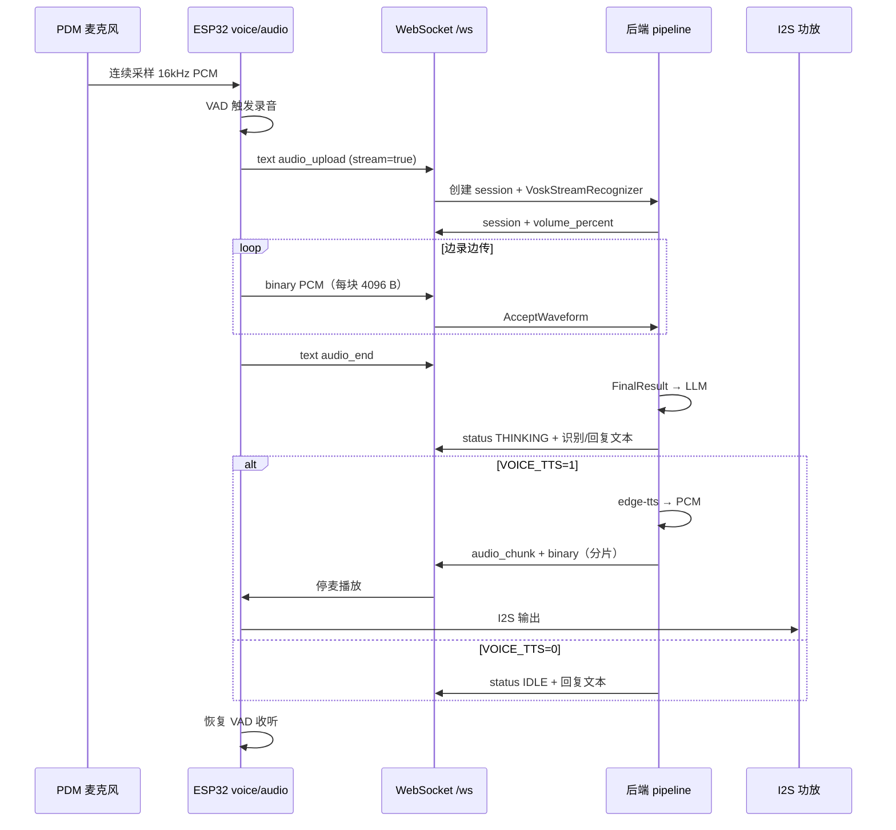

# 语音交互：收听 → 识别 → 回复

本文描述 ESP32 端连续收听（VAD）、WebSocket **边录边传** PCM、PC 后端流式 Vosk ASR / LLM / TTS 与回传播放的完整流程、协议字段与可调参数。通用 WebSocket 握手与 Agent 状态帧见 [README.md](../README.md)。



---

## 1. 总览

| 环节 | 位置 | 说明 |
|------|------|------|
| 采集 | ESP `audio_task`（Core 0） | PDM → 16 kHz / mono / s16le |
| VAD / 状态机 | ESP `app_task` → `voice_loop` | 无按键，开机即听；自适应噪声基线 |
| 上传 | ESP `net_task` → `voice_net_poll` | **主路径**：流式 `audio_upload` + 多帧 binary + `audio_end`；失败回退整段上传 |
| 会话 | 后端 `voice_session` | 内存会话，默认 60 s 超时 |
| ASR | 后端 `asr.py` | 默认 Vosk **流式**中文（`VoskStreamRecognizer`） |
| LLM | 后端 `llm.py` + `chat_context.py` | OpenAI 兼容流式；多轮 context |
| TTS | 后端 `voice_pipeline.py` | 可选 `edge-tts` + `miniaudio`；按句流式合成 |
| 下行音频 | 后端 `ws_manager` pump | `audio_chunk` 分片推送 |
| 播放 | ESP `audio_task` | 环形缓冲 → I2S 功放；**播放期停麦，无 barge-in** |

**红线**：录音与播放 I2S 在 Core 0、`audio_task` 优先级高于 LVGL；VAD 决策在 Core 1 `app_task`，通过队列更新 UI，不直接调用 LVGL。

---

## 2. 设备端

### 2.1 硬件与音频格式

定义见 `main/board_pins.h`、`main/audio.c`。

| 项 | 值 |
|----|-----|
| 麦克风 | PDM，I2S0 RX，CLK=`GPIO15`，DATA=`GPIO16` |
| 功放 | I2S1 TX，Philips，DIN=`GPIO5` / WS=`GPIO6` / BCLK=`GPIO7` |
| 采样率 | 16 kHz（`VOICE_SAMPLE_RATE`） |
| 声道 | 录音 1（mono）；播放侧复制为 stereo 写入 I2S |
| 位深 | 16 bit signed little-endian |
| 最大录音 | 10 s → `VOICE_MAX_RECORD_BYTES` = **320 000 B** |
| 播放环形缓冲 | **128 KB**（`VOICE_PLAY_RING_BYTES`） |
| 流式上传块 | **4096 B**（`VOICE_UPLOAD_CHUNK`，约 128 ms） |
| 录音增益 | `PDM_AMPLIFY = 8`（高通后放大；VAD 用放大后归一化能量） |
| 播放增益 | `PLAY_GAIN_100 = 4`，再乘 `volume_percent`（默认 100%） |

```text
播放样点 = pcm_sample * PLAY_GAIN_100 * volume_percent / 100
```

`volume_percent` 由后端 `session` / `config` 下发（0–100）。**后端 TTS 不再二次缩放 PCM**，避免双重衰减。

menuconfig `CONFIG_AGENT_VOICE_HW` 关闭时，整条语音硬件链路不启用。

### 2.2 任务分工

| 任务 | 核心 | 语音相关职责 |
|------|------|----------------|
| `audio_task` | 0 | PDM 读入、峰值/RMS、录音缓冲、I2S 播放出队 |
| `net_task` | 0 | `voice_net_poll()`：流式开流 / 推块 / `audio_end` 或 bulk 上传 |
| `app_task` | 1 | `voice_loop()` VAD 状态机、UI 状态投递 |
| `lvgl_task` | 1 | 显示语音行；`source=VOICE` 时不覆盖中部 Agent 状态行 |

### 2.3 VAD 状态机

实现：`main/voice.c`。能量为**放大后归一化** RMS / Peak（约 0–1）。

```text
LISTEN ──(越阈且 WS 已连接)──► RECORDING
RECORDING ──(静音超时或最长时长)──► UPLOADING
UPLOADING ──(流式结束或 bulk 成功)──► WAIT_REPLY
WAIT_REPLY ──(收到 audio_chunk)──► PLAYING
WAIT_REPLY ──(服务端 IDLE|ERROR / 本地超时)──► LISTEN
PLAYING ──(播完)──► LISTEN（冷却）
```

| 常量 | 值 | 含义 |
|------|-----|------|
| `VAD_RMS_START_FLOOR` | **0.008** | 起始 RMS 硬下限 |
| `VAD_PEAK_START_FLOOR` | **0.045** | 起始 Peak 硬下限 |
| `VAD_RMS_HOLD_FLOOR` | **0.003** | 保持 RMS 硬下限 |
| `VAD_PEAK_HOLD_FLOOR` | **0.020** | 保持 Peak 硬下限 |
| `VAD_NOISE_MULT` | **3.0** | 阈值 = max(floor, 噪声 × 该倍数) |
| `VAD_NOISE_ALPHA` | **0.05** | 噪声 EMA 系数（仅非语音期更新） |
| `VAD_NOISE_INIT_FRAMES` | **10** | 启动后噪声估计帧数 |
| `VAD_MIN_MS` | **500** | 最短有效录音 |
| `VAD_SILENCE_MS` | **1100** | 静音多久结束录音 |
| `VAD_MAX_MS` | **10000** | 单段最长录音 |
| `VAD_COOLDOWN_MS` | **800** | 结束后冷却 |
| `MIN_CLIP_BYTES` | **6400** | 低于此长度丢弃（约 0.2 s） |
| `WAIT_REPLY_MS` | **40000** | 等待后端回复超时 |

阈值计算：

```text
start_rms  = max(VAD_RMS_START_FLOOR,  noise_rms  * VAD_NOISE_MULT)
start_peak = max(VAD_PEAK_START_FLOOR, noise_peak * VAD_NOISE_MULT)
hold_rms   = max(VAD_RMS_HOLD_FLOOR,   start_rms  * 0.5)
hold_peak  = max(VAD_PEAK_HOLD_FLOOR,  start_peak * 0.5)

起始：rms > start_rms && peak > start_peak
保持：rms > hold_rms  || peak > hold_peak
```

### 2.4 边录边传（设备）

`RECORDING` 期间 `voice_net_poll`：

1. 首次：`net_ws_send_audio_stream_begin` → 发 `audio_upload`（`stream=true`, `audio_len=0`），等待 `session`（最长约 8 s）
2. 之后：录音缓冲每满 **4096 B** 发一帧 binary（每 poll 最多一块）
3. 静音结束进入 `UPLOADING`：冲刷余量 binary → `audio_end`
4. 若开流失败：回退 `net_ws_send_audio_upload` **整段** text+binary

短片段（`< MIN_CLIP_BYTES`）若已开流，会发 `audio_end` 取消后端会话，不进入等待。

### 2.5 播放期行为

- 收到首个 `audio_chunk`：停 PDM 采集，进 `PLAYING`，文案「正在回复（不采集）」
- **无 barge-in**：`PLAYING` 时不做 VAD
- 末片 `end=true` 且播放环空后恢复 `LISTEN` + 冷却

### 2.6 设备 UI 文案（`source=VOICE`）

| 阶段 | `status` | 文案 |
|------|----------|------|
| VAD 开始 / 录音中 / 上传冲刷 | `THINKING` | **正在聆听**（不再显示「正在上传」） |
| 上传成功，等回复 | `THINKING` | **正在思考** |
| TTS 播放中 | `THINKING` | **正在回复（不采集）** |
| 上传失败 | `ERROR` | **上传失败** |
| 结束 / 丢弃短片段 | `IDLE` | （空） |

后端另可能推送：`正在识别`、`正在处理…`、ASR 原文、`没听清，请再说一次`、LLM 流式 `append` 等。

---

## 3. WebSocket 协议（语音相关）

端点：`ws://<pc-ip>:8000/ws`。设备连接后：

```json
{"type":"hello","role":"device","rssi":-58}
```

服务端回：

```json
{"type":"ack","role":"device","server_time":1735689600}
```

### 3.1 ESP → PC：流式上传（主路径）

**① text `audio_upload`（开流）**

```json
{
  "type": "audio_upload",
  "stream": true,
  "sample_rate": 16000,
  "channels": 1,
  "bit_depth": 16,
  "audio_len": 0
}
```

**② 服务端立即回 `session`**（见 3.3），设备记下 `session_id`。

**③ 多帧 binary**：原始 PCM 块，优先每块 **4096** 字节。

**④ text `audio_end`**

```json
{"type":"audio_end","session_id":"a1b2c3d4e5f6"}
```

`session_id` 有则带上。后端此时 `FinalResult`，再启动 LLM/TTS 流水线。

后端判定流式：`stream == true` **或** `audio_len == 0`。

### 3.2 ESP → PC：整段上传（兼容 / 回退）

**帧 1（text）`audio_upload`**

```json
{
  "type": "audio_upload",
  "sample_rate": 16000,
  "channels": 1,
  "bit_depth": 16,
  "audio_len": 48000
}
```

**帧 2（binary）**：全量 PCM，长度须等于 `audio_len`。

设备等待 `session`（最长约 **8 s**）。后端仍可用 `VoskStreamRecognizer` 按 4KB 块喂入后 `finish()`。

### 3.3 PC → ESP：会话确认

```json
{
  "type": "session",
  "session_id": "a1b2c3d4e5f6",
  "volume_percent": 90
}
```

`session_id` 约 12 位 hex。`volume_percent` 同步设备播放增益。

### 3.4 PC → ESP：状态与流式文本

**`status`**

```json
{
  "type": "status",
  "status": "THINKING",
  "text": "你好，有什么可以帮你？",
  "source": "VOICE"
}
```

设备在 `WAIT_REPLY` 且 `source=VOICE`、`status` 为 `IDLE`/`ERROR` 时结束本轮并恢复收听。

**`append`**（LLM 流式增量）

```json
{
  "type": "append",
  "text": "你好",
  "source": "VOICE",
  "reset": true
}
```

### 3.5 PC → ESP：TTS 音频分片

**帧 1（text）`audio_chunk`**

```json
{
  "type": "audio_chunk",
  "session_id": "a1b2c3d4e5f6",
  "len": 4096,
  "end": false
}
```

**帧 2（binary）**：`len` 字节 PCM（16 kHz mono s16le）。`len=0` 且 `end=true` 表示仅结束标记。

| 字段 | 类型 | 说明 |
|------|------|------|
| `session_id` | string | 与上传会话对应；不匹配则丢弃 |
| `len` | int | 本片字节数 |
| `end` | bool | 是否最后一片 |

后端：`AUDIO_CHUNK_BYTES=4096`；泵送 burst 上限 `AUDIO_BURST_BYTES=65536`，间隔 `AUDIO_SEND_INTERVAL_SEC=0.02`。

### 3.6 PC → ESP：音量

```json
{"type":"config","volume_percent":90}
```

连接时、`POST /api/volume`、主动 speak 前会推送。仅设备端增益生效。

### 3.7 错误

```json
{"type":"error","detail":"voice pipeline busy"}
```

常见：`unexpected binary frame`、`audio_len mismatch`、`voice pipeline busy`、`stream session missing`、`no active audio stream`。

---

## 4. 后端处理流水线

实现：`backend/ws_manager.py` → `voice_pipeline.py` → `asr.py` / `llm.py` / `chat_context.py`。

### 4.1 流式路径

1. 收到 `audio_upload`（stream）→ 建空 session + `VoskStreamRecognizer` → 回 `session` → 置 busy  
2. 每帧 binary → `session.append_pcm` + `recognizer.accept`（内部按 4096 喂 Vosk）  
3. `audio_end` → `finish()` 取最终文本  
4. PCM `< 6400` 或空文本 → `IDLE`「没听清，请再说一次」，清 busy  
5. 否则 `mark_stream_asr` → `start_pipeline`（可跳过二次离线 ASR）

### 4.2 流水线步骤（`run_pipeline`）

1. 若 `session.asr_ready` 有文本则直接用；否则 `transcribe_pcm`  
2. 空 → `IDLE`「没听清，请再说一次」  
3. 推送 `THINKING` + 用户文本；写入 Dashboard 日志  
4. LLM 流式（带 `chat_context` 多轮）；`append` 刷新字幕  
5. `VOICE_TTS` 开启：按句 `edge-tts` → PCM 入队 → pump `audio_chunk`  
6. 关闭 TTS：`IDLE` + 全文

忙超时：`VOICE_BUSY_TIMEOUT_SEC = 50`。

### 4.3 会话 `VoiceSession`

| 字段 | 说明 |
|------|------|
| `pcm_data` | 上传累计 PCM |
| `sample_rate` / `channels` / `bit_depth` | 默认 16000 / 1 / 16 |
| `asr_text` / `asr_ready` | 流式 ASR 预填时可跳过离线转写 |
| `llm_text` | 回复全文 |
| `audio_chunks` | TTS 分片队列 |

| 常量 | 值 |
|------|-----|
| `SESSION_TIMEOUT_SEC` | 60 |
| `CHUNK_SIZE` | 4096 |

### 4.4 ASR（`asr.py`）

| 项 | 值 |
|----|-----|
| 默认引擎 | `ASR_ENGINE=vosk` |
| 模型 | `VOSK_MODEL_PATH`，默认 `backend/models/vosk-model-small-cn-0.22` |
| 流式类 | `VoskStreamRecognizer` |
| `SetWords` | **False** |
| 喂入块 | `VOSK_CHUNK_BYTES = 4096` |
| API | `accept()` → `AcceptWaveform` / Partial；`finish()` → 余量 + **`FinalResult`** |

其它引擎：`google`、`faster_whisper` / `whisper`（`WHISPER_MODEL` / `WHISPER_DEVICE`）。

### 4.5 LLM 与多轮

| 变量 | 说明 |
|------|------|
| `LLM_BASE_URL` / `LLM_API_KEY` / `LLM_MODEL` | OpenAI 兼容接口 |
| `CHAT_CONTEXT_MAX_TURNS` | 默认 8 轮 |
| `CHAT_CONTEXT_IDLE_SEC` | 默认 300 s 空闲清空 |

### 4.6 TTS

| 变量 | 默认 | 说明 |
|------|------|------|
| `VOICE_TTS` | `1` | `0`/`false` 关闭 |
| `TTS_VOICE` | `zh-CN-XiaoxiaoNeural` | edge-tts 发音人 |
| `TTS_RATE` | `+20%` | 语速 |

音量只经设备 `volume_percent` 生效；Dashboard `POST /api/volume` 会推 `config` 到设备。

---

## 5. 环境变量与配置汇总

### 5.1 固件 menuconfig

| 配置项 | 说明 |
|--------|------|
| `AGENT_WS_URL` | 后端 WebSocket 地址 |
| `AGENT_VOICE_HW` / `CONFIG_AGENT_VOICE_HW` | 启用 PDM + 功放 |
| WiFi | SSID / 密码等 |

### 5.2 后端 `.env`

| 变量 | 必填 | 说明 |
|------|------|------|
| `LLM_API_KEY` | 走 LLM 时 | API 密钥 |
| `LLM_BASE_URL` / `LLM_MODEL` | 否 | 兼容接口 |
| `VOICE_TTS` / `TTS_VOICE` / `TTS_RATE` | 否 | TTS |
| `ASR_ENGINE` / `VOSK_MODEL_PATH` | 否 | 识别 |
| `CHAT_CONTEXT_MAX_TURNS` / `CHAT_CONTEXT_IDLE_SEC` | 否 | 多轮 |

### 5.3 Python 依赖（语音相关）

见 `backend/requirements.txt`：`fastapi`、`uvicorn`、`httpx`、`vosk`、`SpeechRecognition`、`python-dotenv`、`edge-tts`、`miniaudio` 等。

---

## 6. 异常与并发

| 场景 | 行为 |
|------|------|
| WS 未连接 | VAD 不开始录音 |
| 流式开流失败 | 回退整段 `audio_upload` |
| 上传时 WS 断开 | `ERROR` 上传失败 |
| 后端忙 | 拒绝新上传 / 开流，`voice pipeline busy` |
| 等待回复 40 s 无下行 | 设备结束本轮，恢复收听 |
| PCM `< 6400` | 设备丢弃；后端流式结束亦判过短 |
| ASR 空 | `IDLE`「没听清，请再说一次」 |
| 播放中 | 停麦；异 `session_id` 的 chunk 丢弃 |

同一时刻 `_voice_busy` 仅处理一条语音会话；TTS 泵送完成或超时后释放。

---

## 7. 可选 HTTP 接口（调试）

设备正式路径为 WebSocket。后端另提供 HTTP 备用：

| 方法 | 路径 | 说明 |
|------|------|------|
| `POST` | `/voice/upload` | Body=PCM；头 `X-Audio-Meta` 为 JSON（同 `audio_upload` 字段） |
| `GET` | `/voice/audio/{session_id}` | 拉取 TTS 分片；`204` + `X-Audio-End: 1` 表示结束 |
| `POST` | `/api/volume` | `{"volume_percent":0..100}`，并推送到设备 |

生产环境以 WebSocket 流式 `audio_upload` / binary / `audio_end` / `audio_chunk` 为准。

---

## 8. 相关源码

| 路径 | 职责 |
|------|------|
| `main/voice.c` | VAD 状态机、边录边传、播放停麦 |
| `main/audio.c` | PDM 采集、I2S 播放、增益、缓冲 |
| `main/net_ws.c` | `audio_upload` / binary / `audio_end` / `audio_chunk` |
| `main/board_pins.h` | 引脚、采样率、录音/播放/上传块大小 |
| `backend/ws_manager.py` | WS hub、流式会话、busy、音频泵 |
| `backend/voice_pipeline.py` | ASR → LLM → TTS 编排 |
| `backend/voice_session.py` | 会话存储与分片 |
| `backend/asr.py` | `VoskStreamRecognizer` 与离线适配 |
| `backend/chat_context.py` | 多轮对话上下文 |
| `backend/llm.py` | LLM 调用 |
| `backend/settings_store.py` | 音量持久化 |
