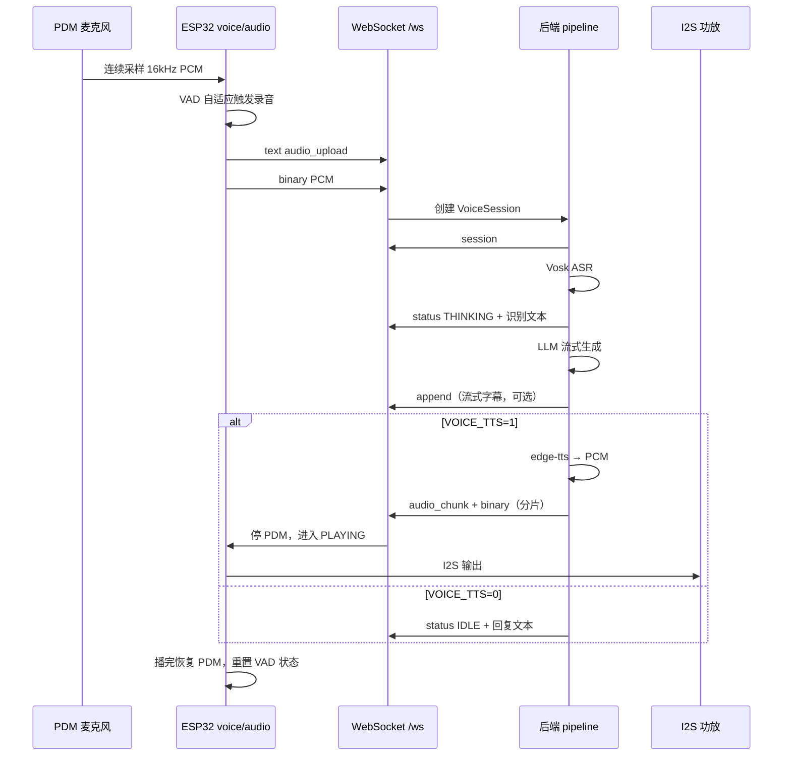

# 语音交互：收听 → 识别 → 回复（VAD 自适应 + 播报期静麦）

> 本版本相对上一版的**核心变更**：
> 1. **播报期不采集人声**：进入 `PLAYING` 后停 PDM，播完才恢复，明确放弃 barge-in。
> 2. **VAD 自适应逻辑重写**：双条件（RMS + Peak）、噪声基线滑动更新、阈值随环境自动调整，替换原来的 `noise_peak×5+350`。
> 3. 顺带修正超时、缓冲、静音尾部等参数不一致问题。
>
> 通用 WebSocket 握手与 Agent 状态帧见 [README.md](README.md)。



---

## 1. 总览

| 环节 | 位置 | 说明 |
|------|------|------|
| 采集 | ESP `audio_task`（Core 0） | PDM → 16 kHz / mono / s16le |
| VAD / 状态机 | ESP `app_task` → `voice_loop` | 无按键，开机即听；**播放期不采集** |
| 上传 | ESP `net_task` → `voice_net_poll` | WebSocket 双帧：元数据 + PCM |
| 会话 | 后端 `voice_session` | 内存会话，默认 60 s 超时 |
| ASR | 后端 `asr.py` | 默认 Vosk 离线中文 |
| LLM | 后端 `llm.py` | OpenAI 兼容 Chat Completions（流式） |
| TTS | 后端 `voice_pipeline.py` | 可选 `edge-tts` + `miniaudio` 解码 |
| 下行音频 | 后端 `ws_manager.run_session_pump` | `audio_chunk` 分片推送 |
| 播放 | ESP `audio_task` | 环形缓冲 → I2S 功放 |

**红线**：录音与播放 I2S 在 Core 0、`audio_task` 优先级 **6**（高于 LVGL）；VAD 决策在 Core 1 `app_task`，通过队列更新 UI，不直接调用 LVGL。

**本版明确不做 barge-in**：播放期间 PDM 关闭，不检测人声，不打断当前回复。用户若要打断，需等本轮播完。

---

## 2. 设备端

### 2.1 硬件与音频格式

| 项 | 值 |
|----|-----|
| 麦克风 | PDM，I2S0 RX，CLK=GPIO15，DATA=**GPIO16** |
| 功放 | I2S1 TX，Philips，DIN=5 / WS=6 / BCLK=7 |
| 采样率 | 16 kHz |
| 声道 | 1（mono） |
| 位深 | 16 bit signed little-endian |
| PDM 帧长 | **256 samples / 512 B / 16 ms** |
| 最大录音时长 | 10 s（`VOICE_MAX_RECORD_BYTES` = 320 000 B） |
| 播放环形缓冲 | **128 KB**（`VOICE_PLAY_RING_BYTES`，原 32 KB 只够 1 s） |
| 播放增益 | 固件内 `PLAY_GAIN_100=4`；再乘 `volume_percent`（默认 100%） |

menuconfig `CONFIG_AGENT_VOICE_HW` 关闭时，整条语音链路不编译运行。

### 2.2 任务分工

| 任务 | 核心 | 语音相关职责 |
|------|------|----------------|
| `audio_task` | 0 | PDM 读入、能量统计、录音缓冲、I2S 播放出队 |
| `net_task` | 0 | `voice_net_poll()` 发送 `audio_upload` |
| `app_task` | 1 | `voice_loop()` VAD 状态机、UI 状态投递 |
| `lvgl_task` | 1 | 显示语音行；`source=VOICE` 时不覆盖中部 Agent 状态行 |

**播放期间 `audio_task` 不读 PDM**，只做 I2S TX 出队；`voice_loop` 处于 `PLAYING` 时不做 VAD 判定。

### 2.3 VAD 状态机

```text
LISTEN ──(检测到语音且 WS 已连接)──► RECORDING
RECORDING ──(静音超时或达到最长时长)──► UPLOADING
UPLOADING ──(上传完成)──► WAIT_REPLY
WAIT_REPLY ──(收到 TTS 播放 / 服务端 IDLE|ERROR / 本地超时)──► LISTEN
任意阶段 ──(收到 audio_chunk)──► PLAYING ──(播完)──► LISTEN
```

**PLAYING 阶段**：停 PDM、启 I2S TX；只判断「服务端发完 + 本地缓冲播完」，不做 VAD。播完后 `finish_turn()` → `resume_listen()` → 重置 VAD 噪声基线 → `LISTEN`。

### 2.4 VAD 自适应逻辑（本版重写）

#### 2.4.1 设计目标

- 安静环境不误触发（呼吸、鼠标、风扇）。
- 嘈杂环境不漏触发（空调、键盘、远处人声）。
- 阈值随环境自动调整，不需要用户手动配置。
- 瞬态噪声（敲击、碰桌）不触发。

#### 2.4.2 每帧能量计算

`audio_task` 每 16 ms 读 256 个 int16 样本，计算：

```c
// 归一化到 [-1, 1]
float sum_sq = 0, peak = 0;
for (int i = 0; i < n; i++) {
    float x = sample_buf[i] / 32768.0f;
    sum_sq += x * x;
    float ax = fabsf(x);
    if (ax > peak) peak = ax;
}
float rms = sqrtf(sum_sq / n);   // 归一化 RMS，0~1
// peak 已是归一化峰值，0~1
```

同时送一阶高通，去掉 120 Hz 以下风噪/桌面震动：

```c
static float hp_x1 = 0, hp_y1 = 0;
float y = 0.985f * (hp_y1 + x - hp_x1);
hp_x1 = x; hp_y1 = y;
x = y;   // 后续用高通后的 x 计算 rms/peak
```

#### 2.4.3 噪声基线滑动更新

维护两个指数滑动平均（EMA），**只在判定为「非语音」的帧更新**：

```c
// 初始化：开机后前 20 帧（约 320 ms）强制当作噪声
if (s_noise_init_frames < 20) {
    s_noise_rms  = (s_noise_rms  * s_noise_init_frames + rms)  / (s_noise_init_frames + 1);
    s_noise_peak = (s_noise_peak * s_noise_init_frames + peak) / (s_noise_init_frames + 1);
    s_noise_init_frames++;
    return;   // 初始化期间不触发
}

// 仅在「当前不是语音」时更新基线
if (!s_in_speech) {
    const float alpha = 0.05f;   // 时间常数约 20 帧 = 320 ms
    s_noise_rms  = (1 - alpha) * s_noise_rms  + alpha * rms;
    s_noise_peak = (1 - alpha) * s_noise_peak + alpha * peak;
}
```

`s_in_speech` 是当前状态机是否处于 `RECORDING`（或刚结束的 200 ms 挂起期内）。**语音期间不更新基线**，避免把人声当噪声。

#### 2.4.4 阈值计算

```c
// 起始阈值：噪声基线的 3 倍，且不低于硬下限
#define VAD_RMS_START_FLOOR   0.006f   // 归一化 RMS
#define VAD_PEAK_START_FLOOR  0.04f
#define VAD_NOISE_MULT        3.0f

float start_rms_th  = fmaxf(VAD_RMS_START_FLOOR,  s_noise_rms  * VAD_NOISE_MULT);
float start_peak_th = fmaxf(VAD_PEAK_START_FLOOR, s_noise_peak * VAD_NOISE_MULT);

// 保持阈值：比起始低，录音中灵敏度更高
#define VAD_RMS_HOLD_FLOOR   0.003f
#define VAD_PEAK_HOLD_FLOOR  0.02f
float hold_rms_th  = fmaxf(VAD_RMS_HOLD_FLOOR,  start_rms_th  * 0.5f);
float hold_peak_th = fmaxf(VAD_PEAK_HOLD_FLOOR, start_peak_th * 0.5f);
```

**双条件判定**：

```c
// 起始：RMS 和 Peak 必须同时满足（过滤瞬态噪声）
bool start = (rms > start_rms_th) && (peak > start_peak_th);

// 保持：任一满足即可（录音中不漏字）
bool hold = (rms > hold_rms_th) || (peak > hold_peak_th);
```

原实现只用 peak 自适应，容易被敲键盘、碰桌子这类瞬态噪声抬高基线；本版用 **RMS 主导 + Peak 辅助**，瞬态噪声只满足 peak 不满足 RMS，不会误触发，也不会污染基线。

#### 2.4.5 状态机集成

```text
LISTEN:
  if (start && ws_connected) {
      进入 RECORDING;
      s_in_speech = true;
      s_speech_frames = 0;
      s_silence_frames = 0;
  }

RECORDING:
  if (hold) {
      s_silence_frames = 0;
      s_speech_frames++;
  } else {
      s_silence_frames++;
  }
  // 静音超时结束
  if (s_silence_frames * 16 >= VAD_SILENCE_MS) {
      进入 UPLOADING;
      s_in_speech = false;   // 允许基线恢复更新
  }
  // 最长时长强制结束
  if (s_speech_frames * 16 >= VAD_MAX_MS) {
      进入 UPLOADING;
      s_in_speech = false;
  }
```

**播放结束后重置**：`finish_turn()` 里 `resume_listen()` 时，把 `s_noise_init_frames` 清零，强制重新采 20 帧基线——因为播放期间环境可能变了（用户挪了设备、开了空调）。

#### 2.4.6 参数表（替换原 2.3 常量表）

| 常量 | 值 | 含义 |
|------|-----|------|
| `VAD_RMS_START_FLOOR` | 0.006 | 起始 RMS 硬下限（归一化） |
| `VAD_PEAK_START_FLOOR` | 0.04 | 起始 Peak 硬下限（归一化） |
| `VAD_NOISE_MULT` | 3.0 | 阈值 = 噪声基线 × 该倍数 |
| `VAD_RMS_HOLD_FLOOR` | 0.003 | 保持 RMS 硬下限 |
| `VAD_PEAK_HOLD_FLOOR` | 0.02 | 保持 Peak 硬下限 |
| `VAD_NOISE_ALPHA` | 0.05 | 噪声基线 EMA 系数（≈320 ms） |
| `VAD_NOISE_INIT_FRAMES` | 20 | 开机/恢复后的基线采集帧数（320 ms） |
| `VAD_MIN_MS` | 500 | 最短有效录音 |
| `VAD_SILENCE_MS` | **1100** | 静音多久结束录音（原 900 偏短） |
| `VAD_MAX_MS` | **10000** | 单段最长录音（原 6000 偏短，与 10 s 缓冲对齐） |
| `VAD_COOLDOWN_MS` | **800** | 丢弃短片段后的冷却（原 1500 偏长） |
| `MIN_CLIP_BYTES` | **6400** | 低于此长度丢弃（0.2 s，原 12800=0.4 s 会误丢「嗯」「好」） |
| `WAIT_REPLY_MS` | **40000** | 等待后端回复超时（原 25000 与后端 60 s 不匹配） |

#### 2.4.7 阈值换算参考（16 kHz / 256 样本 / 16 ms）

| 归一化 RMS | 对应 int16 RMS | 典型场景 |
|---|---|---|
| 0.001 | 33 | 极安静，PDM 底噪 |
| 0.003 | 98 | 安静室内底噪 |
| 0.006 | 197 | 起始硬下限 |
| 0.008 | 262 | 空调/风扇背景声 |
| 0.02 | 655 | 正常说话（近场） |
| 0.05 | 1638 | 大声说话 |

### 2.5 设备 UI 状态（`source=VOICE`）

| 阶段 | `status` | 底部语音行文案 |
|------|----------|----------------|
| 开始录音 | `THINKING` | 正在聆听 |
| 上传中 | `THINKING` | 正在上传 |
| 等待回复 | `THINKING` | 正在思考 |
| 播放中 | `THINKING` | 正在回复（不采集） |
| 失败 | `ERROR` | 上传失败 / 服务端错误 |
| 仅文本回复（无 TTS） | `IDLE` | LLM 全文 |
| 流式生成中 | `THINKING` | 通过 `append` 增量刷新 |

---

## 3. WebSocket 协议（语音相关）

端点：`ws://<pc-ip>:8000/ws`。设备连接后首帧：

```json
{"type":"hello","role":"device","rssi":-58}
```

服务端回：

```json
{"type":"ack","role":"device","server_time":1735689600}
```

### 3.1 ESP → PC：上传语音

**帧 1（text）`audio_upload`**

```json
{
  "type": "audio_upload",
  "sample_rate": 16000,
  "channels": 1,
  "bit_depth": 16,
  "audio_len": 48000
}
```

**帧 2（binary）**：原始 PCM，`audio_len` 字节。

设备发送 binary 后等待 `session`（最长 **8 s**）。未收到则上传失败。

### 3.2 PC → ESP：会话确认

```json
{"type":"session","session_id":"a1b2c3d4e5f6","volume_percent":33}
```

`session_id` 为 12 位十六进制，由后端 `uuid.uuid4().hex[:12]` 生成。**本版新增 `volume_percent`**，设备自动应用，避免手动下发 `config`。

### 3.3 PC → ESP：状态与流式文本

**`status`**（完整状态，含 `source`）

```json
{
  "type": "status",
  "status": "THINKING",
  "text": "你好，有什么可以帮你？",
  "source": "VOICE"
}
```

设备在 `WAIT_REPLY` 阶段若收到 `source=VOICE` 且 `status` 为 `IDLE` 或 `ERROR`，结束等待并恢复收听。

**`append`**（LLM 流式增量，仅更新底部语音行）

```json
{
  "type": "append",
  "text": "你好",
  "source": "VOICE",
  "reset": true
}
```

`reset: true` 表示新一轮回复开始，清空后再追加；后续分片 `reset: false` 或省略。

**`text`**：与 Agent 共用的纯文本下行，语音场景较少使用。

### 3.4 PC → ESP：TTS 音频分片

**帧 1（text）`audio_chunk`**

```json
{
  "type": "audio_chunk",
  "session_id": "a1b2c3d4e5f6",
  "len": 4096,
  "end": false
}
```

**帧 2（binary）**：`len` 字节 PCM（16 kHz mono s16le）。`len=0` 且 `end=true` 表示无音频结束。

| 字段 | 类型 | 说明 |
|------|------|------|
| `session_id` | string | 与上传会话或 `speak` 会话对应 |
| `len` | int | 本片字节数，0 表示仅结束标记 |
| `end` | bool | 是否为最后一片 |

后端分片大小 **4096 B**（`CHUNK_SIZE`），泵送时每 burst 最多 **16 384 B** 后节流（约一个 chunk 的播放时长）。

**设备端行为**：收到首片二进制即进入 `PLAYING`：**停 PDM**、启 I2S TX，写入播放环；**末片播完且 `s_audio_end && pending==0` 双条件满足**才恢复 VAD。**播放期间不读 PDM，不做 VAD。**

设备端同时校验 `session_id` 是否匹配当前轮；不匹配的 `audio_chunk` 直接丢弃（防止旧 session 尾片晚到误播）。

### 3.5 PC → ESP：音量（可选）

```json
{"type":"config","volume_percent":33}
```

固件将 `volume_percent`（0–100）与内部 4× 增益相乘。本版起 `session` 帧已带 `volume_percent`，`config` 帧保留用于运行时调整。

### 3.6 错误

```json
{"type":"error","detail":"voice pipeline busy"}
```

常见 `detail`：`unexpected binary frame`、`audio_len mismatch`、`voice pipeline busy`。

---

## 4. 后端处理流水线

实现：`backend/ws_manager.py` → `voice_pipeline.py` → `asr.py` / `llm.py`。

### 4.1 收到上传后的步骤

1. 校验 `audio_len` 与 binary 长度一致。
2. 若 `_voice_busy`，拒绝新上传。
3. `session_store.create(pcm)`，立即回 `session`（含 `volume_percent`）。
4. 后台线程 `start_pipeline(session_id, …)`：
   - **ASR**：`transcribe_pcm` → 推送 `THINKING` + 用户文本；写入 Dashboard 识别日志。
   - **LLM**（需 `LLM_API_KEY`）：流式 `llm_chat`，通过 `append` 刷新设备字幕；完成后写入助手日志。
   - **无 LLM Key**：仅 ASR，推送 `IDLE` + 识别文本，结束。
   - **TTS**（`VOICE_TTS` 非 0）：`edge-tts` 合成 MP3 → `miniaudio` 解码为 16 kHz PCM → `session.set_tts_pcm`；`run_session_pump` 推送 `audio_chunk`。
   - **无 TTS**：推送 `IDLE` + 完整回复文本。

### 4.2 会话对象 `VoiceSession`

| 字段 | 说明 |
|------|------|
| `pcm_data` | 上传的原始 PCM |
| `sample_rate` / `channels` / `bit_depth` | 默认 16000 / 1 / 16 |
| `phase` | `received` → `asr` → `llm` → `tts` → `ready` → `playing` → `done` / `error` |
| `asr_text` / `llm_text` | 识别与回复全文 |
| `audio_pcm` / `audio_chunks` | TTS 结果及分片队列 |

| 常量 | 值 |
|------|-----|
| `SESSION_TIMEOUT_SEC` | 60 |
| `CHUNK_SIZE` | 4096 |
| `VOICE_BUSY_TIMEOUT_SEC` | **50**（与设备 40 s 超时留余量） |

### 4.3 ASR 引擎

环境变量 `ASR_ENGINE`（默认 `vosk`）：

| 值 | 依赖 | 说明 |
|----|------|------|
| `vosk` | `vosk` + 中文模型 | 默认；模型路径见 README 附录 |
| `google` | `SpeechRecognition` | 在线 Google 识别 |
| `faster_whisper` / `whisper` | `pip install faster-whisper` | 本地 Whisper |

| 变量 | 默认 | 说明 |
|------|------|------|
| `VOSK_MODEL_PATH` | `backend/models/vosk-model-small-cn-0.22` | Vosk 模型目录 |
| `WHISPER_MODEL` | `base` | faster-whisper 模型名 |
| `WHISPER_DEVICE` | `cpu` | 推理设备 |

**ASR 空结果处理**：推送 `IDLE` + 提示「没听清，请再说一次」，而非 `ERROR`。避免设备进 ERROR 后需用户手动恢复。

### 4.4 LLM

| 变量 | 说明 |
|------|------|
| `LLM_BASE_URL` | OpenAI 兼容根地址（见 `backend/.env.example`） |
| `LLM_API_KEY` | 必填才走 LLM；空则仅 ASR |
| `LLM_MODEL` | 模型标识 |

请求：`POST {base}/v1/chat/completions`，`stream: true`。System 提示要求简体中文短答、无 Markdown。温度 `0.7`。

### 4.5 TTS

| 变量 | 默认 | 说明 |
|------|------|------|
| `VOICE_TTS` | 代码默认 `"1"`；`.env.example` 为 `0` | `0` / `false` 关闭；非 0 开启 |
| `TTS_VOICE` | `zh-CN-XiaoxiaoNeural` | edge-tts 发音人 |

流程：`edge_communicate` → MP3 → `miniaudio.decode`（16 kHz mono s16）→ `scale_pcm16(volume)` → 分片下发。

### 4.6 音量与 Dashboard

| 存储 | 默认 | 说明 |
|------|------|------|
| `backend/settings.json` → `volume_percent` | 33 | TTS PCM 缩放；100 为满幅 |

HTTP：`POST /api/volume` `{"volume_percent":50}`。设备端 `config` 帧协议已支持；本版起 `session` 帧自动带 `volume_percent`，无需手动下发。

---

## 5. 环境变量与配置汇总

### 5.1 固件 menuconfig（Agent Display）

| 配置项 | 说明 |
|--------|------|
| `AGENT_WS_URL` | 后端 WebSocket 地址 |
| `AGENT_VOICE_HW` | 启用 PDM + 功放语音硬件 |
| WiFi 相关 | SSID / 密码 / 静态 IP（与语音链路无关，但影响连接） |

### 5.2 后端 `backend/.env`

| 变量 | 必填 | 说明 |
|------|------|------|
| `LLM_API_KEY` | 走 LLM 时 | API 密钥 |
| `LLM_BASE_URL` | 否 | 兼容接口根地址 |
| `LLM_MODEL` | 否 | 模型名 |
| `VOICE_TTS` | 否 | 是否 TTS 回传 |
| `TTS_VOICE` | 否 | edge-tts 音色 |
| `ASR_ENGINE` | 否 | 识别引擎 |
| `VOSK_MODEL_PATH` | Vosk 时 | 模型目录 |

### 5.3 Python 依赖（语音相关）

见 `backend/requirements.txt`：`fastapi`、`uvicorn`、`httpx`、`vosk`、`SpeechRecognition`、`python-dotenv`、`edge-tts`、`miniaudio`。

---

## 6. 异常与并发

| 场景 | 行为 |
|------|------|
| WS 未连接 | VAD 不开始录音 |
| 上传时 WS 断开 | `ERROR` 上传失败 |
| 后端忙 | 丢弃新 `audio_upload`，返回 `voice pipeline busy` |
| 等待回复 40 s 无下行 | 设备 `finish_turn`，恢复 `IDLE` 收听 |
| 短于 0.2 s 的片段 | 丢弃，冷却 0.8 s |
| ASR 空结果 | `IDLE`「没听清，请再说一次」 |
| LLM 失败 | `ERROR`「LLM 无回复」或异常摘要 |
| 播放中收到新 `audio_chunk` | **同 session 续播；异 session 丢弃** |
| 播放中收到人声 | **不采集、不打断**（本版设计） |
| 播放结束 | 重置 VAD 噪声基线（`s_noise_init_frames=0`），重新采 320 ms |

同一时刻后端 `_voice_busy` 仅处理一条语音会话；TTS 泵送完成或超时后释放。设备端 `WAIT_REPLY_MS=40000` 与后端 `VOICE_BUSY_TIMEOUT_SEC=50` 留 10 s 余量。

---

## 7. 可选 HTTP 接口（调试）

设备正式路径为 WebSocket。后端另提供 HTTP 备用（无 `session` 握手，需轮询音频）：

| 方法 | 路径 | 说明 |
|------|------|------|
| `POST` | `/voice/upload` | Body=PCM；头 `X-Audio-Meta` 为 JSON 元数据（同 `audio_upload` 字段） |
| `GET` | `/voice/audio/{session_id}` | 拉取 TTS 分片；`204` + `X-Audio-End: 1` 表示结束 |

生产环境以 WebSocket `audio_upload` / `audio_chunk` 为准。

---

## 8. 相关源码

| 路径 | 职责 |
|------|------|
| `main/voice.c` | VAD 状态机、上传触发、播放回调 |
| `main/audio.c` | PDM 采集、高通、能量统计、I2S 播放、缓冲 |
| `main/net_ws.c` | `audio_upload` 发送、WS 帧分发 |
| `main/board_pins.h` | 采样率、缓冲上限等常量 |
| `backend/ws_manager.py` | WS hub、busy 锁、音频泵 |
| `backend/voice_pipeline.py` | ASR → LLM → TTS 编排 |
| `backend/voice_session.py` | 会话存储与分片 |
| `backend/asr.py` | 语音识别适配 |
| `backend/llm.py` | 流式 LLM 客户端 |

---

## 附录 A：本次修改对照表

| 项 | 旧值/旧逻辑 | 新值/新逻辑 |
|---|---|---|
| 播放期采集 | 停 PDM，不 VAD | **同左，明确不做 barge-in** |
| VAD 起始阈值 | `peak > max(1400, noise_peak×5+350)` | **RMS 和 Peak 双条件**，阈值 = 噪声基线 × 3，硬下限 0.006/0.04 |
| VAD 保持阈值 | `peak > 480` / `rms > 90` | 起始阈值 × 0.5，硬下限 0.003/0.02 |
| 噪声基线更新 | 未明确 | **仅非语音帧 EMA 更新**，α=0.05；开机/恢复后强制采 20 帧 |
| 前端高通 | 无 | **一阶 IIR，fc≈120 Hz** |
| `VAD_SILENCE_MS` | 900 | **1100** |
| `VAD_MAX_MS` | 6000 | **10000** |
| `VAD_COOLDOWN_MS` | 1500 | **800** |
| `MIN_CLIP_BYTES` | 12800 | **6400** |
| `WAIT_REPLY_MS` | 25000 | **40000** |
| `VOICE_PLAY_RING_BYTES` | 32 KB | **128 KB** |
| 播放结束判定 | 缓冲空 | **`s_audio_end && pending==0` 双条件** |
| `audio_chunk` session 校验 | 无 | **设备端校验 `session_id`，不匹配丢弃** |
| `session` 帧 | 仅 `session_id` | **新增 `volume_percent`** |
| ASR 空结果 | `ERROR` | **`IDLE` + 提示重说** |
| 后端 busy 超时 | 45 s | **50 s**（与设备 40 s 留余量） |
| 播放结束 VAD 重置 | 无 | **`s_noise_init_frames=0`，重采 320 ms 基线** |

## 附录 B：VAD 伪代码（可直接对照改 `voice.c`）

```c
// ---- 每帧由 audio_task 调用 ----
typedef struct {
    float noise_rms, noise_peak;
    int   noise_init_frames;
    bool  in_speech;
    int   silence_frames, speech_frames;
} vad_state_t;

static vad_state_t s_vad = { .noise_rms = 0.001f, .noise_peak = 0.005f };

void vad_on_frame(float rms, float peak) {
    // 1) 初始化 / 恢复后强制采基线
    if (s_vad.noise_init_frames < VAD_NOISE_INIT_FRAMES) {
        int n = s_vad.noise_init_frames;
        s_vad.noise_rms  = (s_vad.noise_rms  * n + rms)  / (n + 1);
        s_vad.noise_peak = (s_vad.noise_peak * n + peak) / (n + 1);
        s_vad.noise_init_frames++;
        return;
    }

    // 2) 计算阈值
    float start_rms  = fmaxf(VAD_RMS_START_FLOOR,  s_vad.noise_rms  * VAD_NOISE_MULT);
    float start_peak = fmaxf(VAD_PEAK_START_FLOOR, s_vad.noise_peak * VAD_NOISE_MULT);
    float hold_rms   = fmaxf(VAD_RMS_HOLD_FLOOR,   start_rms  * 0.5f);
    float hold_peak  = fmaxf(VAD_PEAK_HOLD_FLOOR,  start_peak * 0.5f);

    // 3) 非语音帧更新基线
    if (!s_vad.in_speech) {
        s_vad.noise_rms  = (1 - VAD_NOISE_ALPHA) * s_vad.noise_rms  + VAD_NOISE_ALPHA * rms;
        s_vad.noise_peak = (1 - VAD_NOISE_ALPHA) * s_vad.noise_peak + VAD_NOISE_ALPHA * peak;
    }

    // 4) 状态机
    switch (s_phase) {
    case LISTEN:
        if ((rms > start_rms && peak > start_peak) && ws_connected()) {
            s_phase = RECORDING;
            s_vad.in_speech = true;
            s_vad.speech_frames = 0;
            s_vad.silence_frames = 0;
        }
        break;
    case RECORDING:
        if (rms > hold_rms || peak > hold_peak) {
            s_vad.silence_frames = 0;
            s_vad.speech_frames++;
        } else {
            s_vad.silence_frames++;
        }
        if (s_vad.silence_frames * 16 >= VAD_SILENCE_MS ||
            s_vad.speech_frames  * 16 >= VAD_MAX_MS) {
            s_phase = UPLOADING;
            s_vad.in_speech = false;
        }
        break;
    default:
        break;
    }
}

// ---- finish_turn() 里恢复收听时 ----
void resume_listen(void) {
    s_vad.noise_init_frames = 0;   // 强制重采基线
    s_vad.in_speech = false;
    s_vad.silence_frames = 0;
    s_vad.speech_frames = 0;
    s_phase = LISTEN;
}
```

---

**落地顺序建议**：

1. 先按附录 B 替换 `voice.c` 的 VAD 判定，用日志打印 `rms/peak/start_rms/start_peak`，观察 1~2 天，确认安静/嘈杂环境都不误触发、不漏触发。
2. 加 `audio.c` 的前端高通，观察噪声基线是否下降。
3. 改参数表（`VAD_SILENCE_MS` 等）和播放环形缓冲 128 KB。
4. 最后加 `session_id` 校验和 `session` 帧的 `volume_percent`。

前三步都是固件内独立改动，不动协议；第 4 步动协议，前后端需同批。